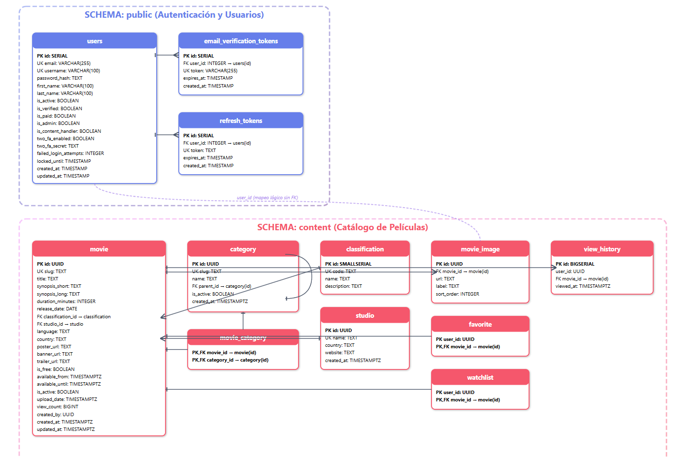

# Base de Datos – ChapinFlix

Este proyecto utiliza PostgreSQL como motor de base de datos y está organizado en schemas separados para mantener la seguridad, la escalabilidad y el desacoplamiento entre autenticación y catálogo de películas.

---

## Diseño General

La base de datos se divide en dos dominios principales:

- **Schema `public`** → Manejo de autenticación y usuarios.
- **Schema `content`** → Catálogo de películas, categorías, imágenes y métricas de uso.

---

## Schema `public`

Contiene las entidades relacionadas con usuarios y seguridad:

- `users` → Información de cuentas, roles y flags (activo, verificado, admin, etc.).
- `email_verification_tokens` → Tokens de verificación de correo.
- `refresh_tokens` → Manejo de sesiones con JWT.

---

## Schema `content`

Contiene las entidades relacionadas con el catálogo de películas:

- `movie` → Películas registradas en el sistema.
- `category` → Categorías jerárquicas (géneros, etiquetas).
- `movie_category` → Relación N:M entre películas y categorías.
- `classification` → Clasificaciones por edad/país.
- `studio` → Estudios de producción.
- `movie_image` → Galería de imágenes por película.
- `favorite`, `watchlist` → Listas personalizadas de los usuarios.
- `view_history` → Historial de visualización y conteo de vistas.

---

## Conexiones Lógicas

- Los `user_id` de tablas como `favorite`, `watchlist` y `view_history` se mapean lógicamente a `public.users`.  
- No existe una FK física entre schemas para mantener el desacoplamiento, pero se usan funciones PL/pgSQL que garantizan la integridad.

---

## Diagrama Entidad–Relación

### Vista general (captura PNG)

  

---
## Notas de Diseño

- **Normalización:** 3NF, con desnormalización controlada (`view_count`).
- **Escalabilidad:** UUIDs en el schema `content` permiten partición futura.
- **Seguridad:** Separación clara entre usuarios/autenticación y catálogo.
- **Performance:** Índices y funciones optimizadas.
- **Flexibilidad:** Categorías jerárquicas y relaciones N:M.

---

## Conclusión

La base de datos de ChapinFlix está diseñada para ser segura, escalable y flexible, con una separación clara entre autenticación y catálogo, facilitando el despliegue en entornos de microservicios y Kubernetes.
