# Diagramas de Secuencia – ChapinFlix

Este documento contiene los diagramas de secuencia de los **Casos de Uso (CDU)** definidos en el sistema.

---

## CUN 100 – Autenticación

### CDU 101 – Registrar Usuario

  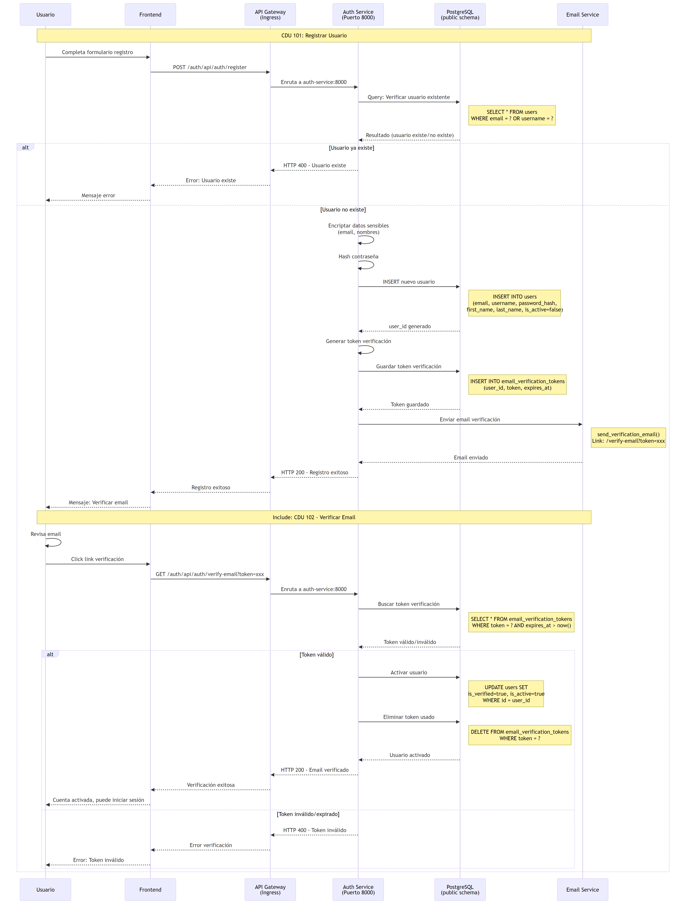

### CDU 103 – Iniciar Sesión

  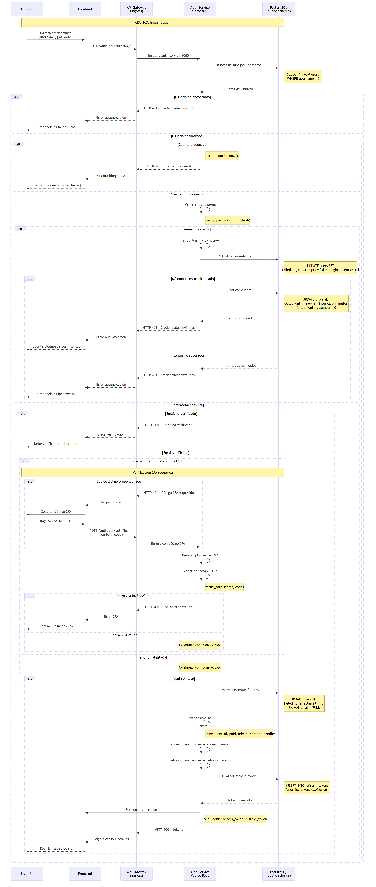

---

## CUN 200 – Ver Catálogo

### CDU 201 – Explorar Carruseles Principales

  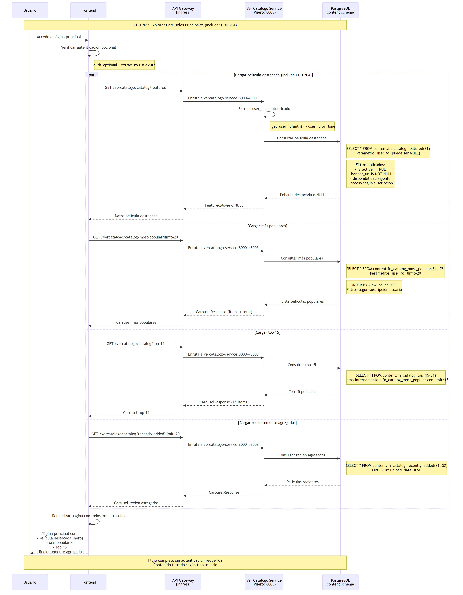

### CDU 202 – Explorar Catálogo Personal

  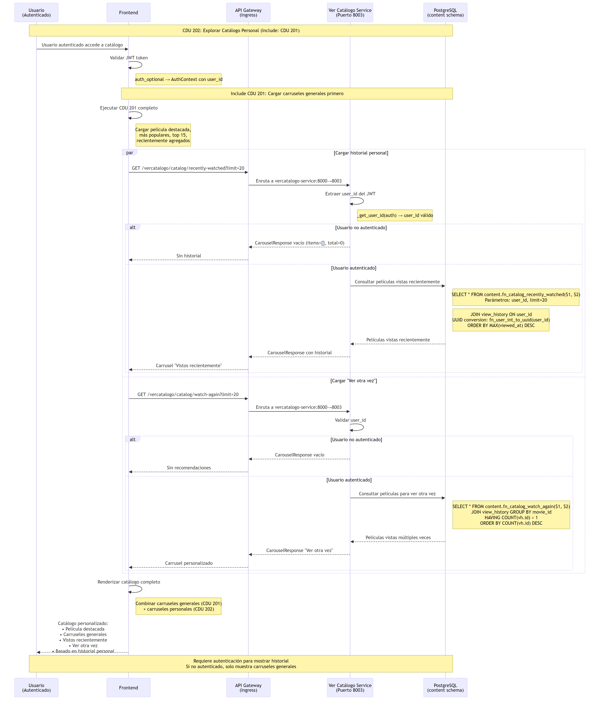

### CDU 203 – Navegar por Categorías

  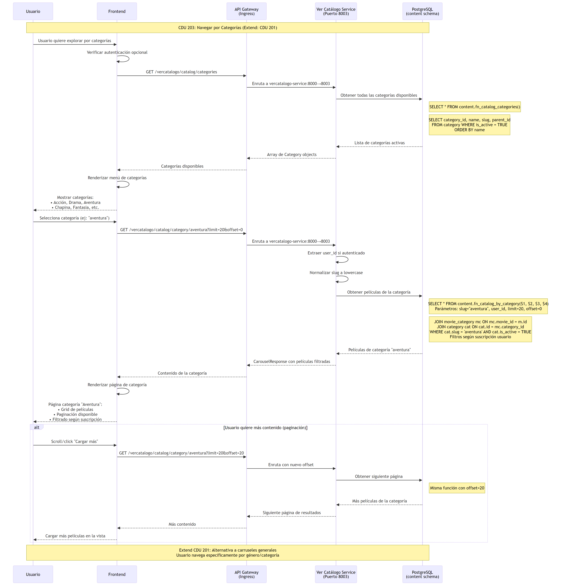

---

## CUN 300 – Ver Película

### CDU 301 – Consultar Detalles de Película

  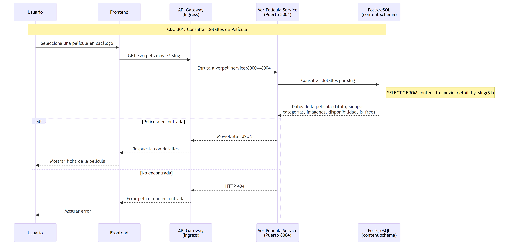

### CDU 302 – Validar Acceso a Contenido

  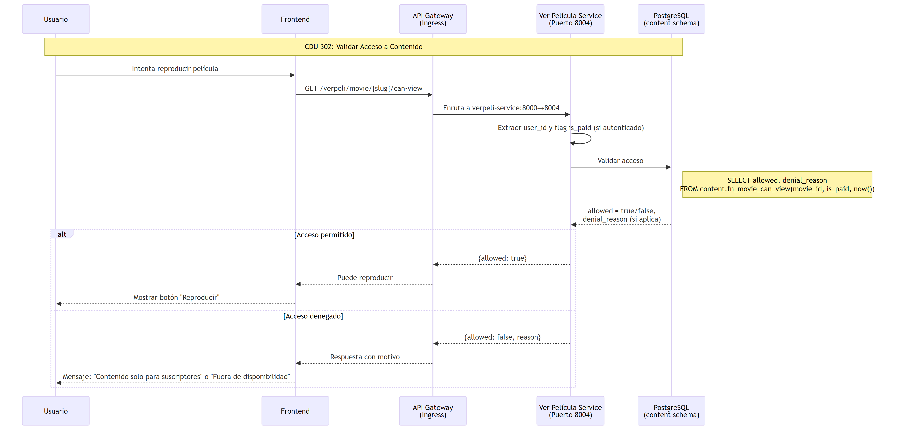

### CDU 303 – Reproducir Película

  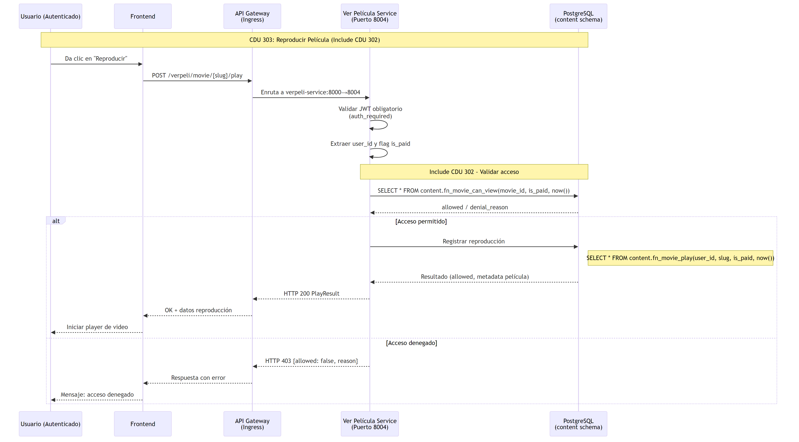

---

## CUN 400 – Gestión de Usuarios

### CDU 401 – Buscar Usuario

  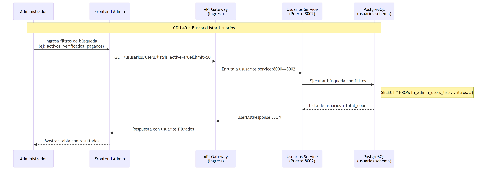

### CDU 402 – Consultar Detalle de Usuario  
*(incluido en otros flujos, representado dentro de Buscar Usuario, Modificar Estado y Gestionar Roles)*

### CDU 403 – Modificar Estado de Usuario

  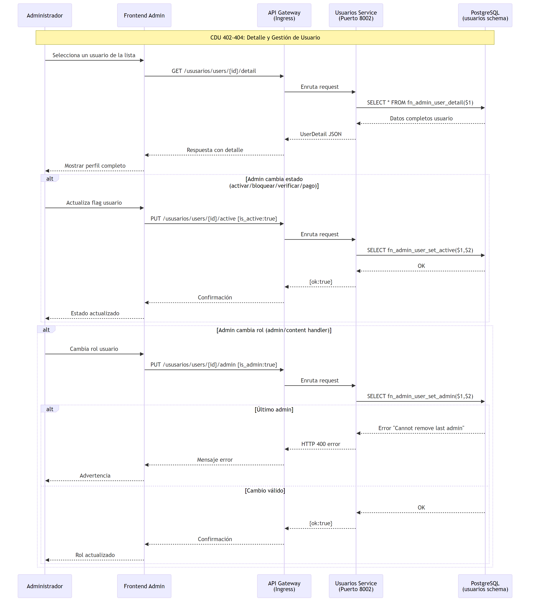

### CDU 404 – Gestionar Roles de Usuario  
*(incluido en la gestión de usuario general)*

---

## CUN 500 – Gestión de Catálogo

### CDU 501 – Gestionar Películas

  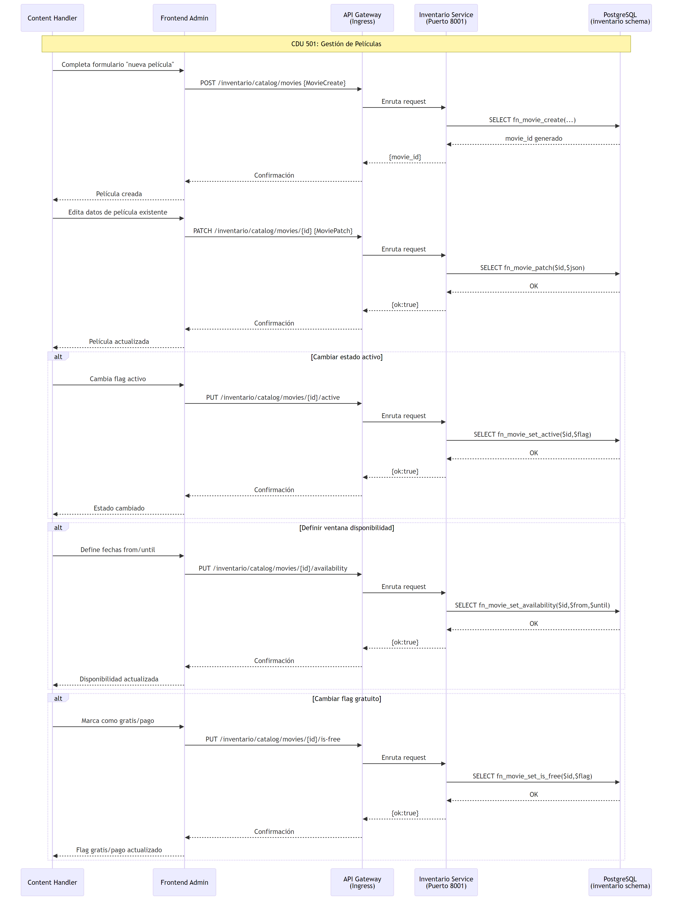

### CDU 502 – Gestionar Categorías de Películas

  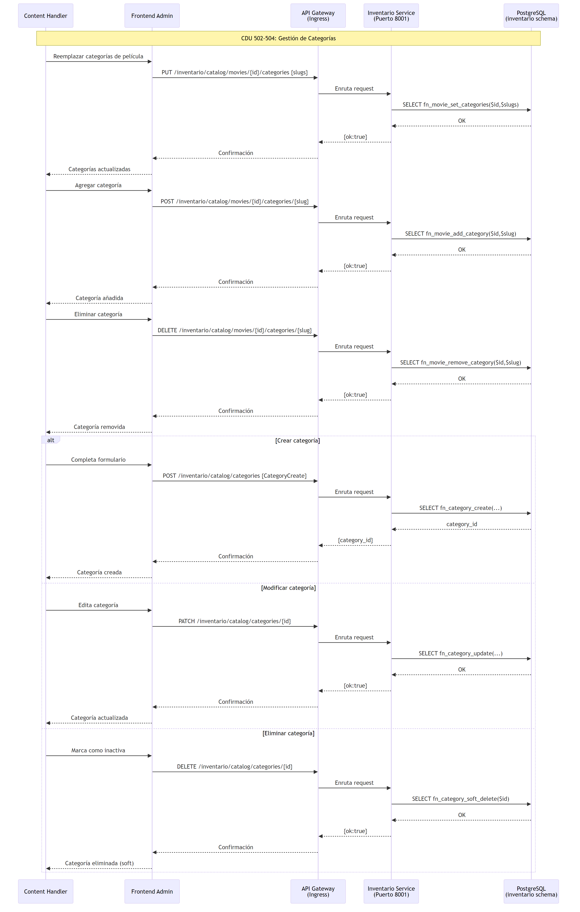

### CDU 503 – Gestionar Galería de Imágenes

  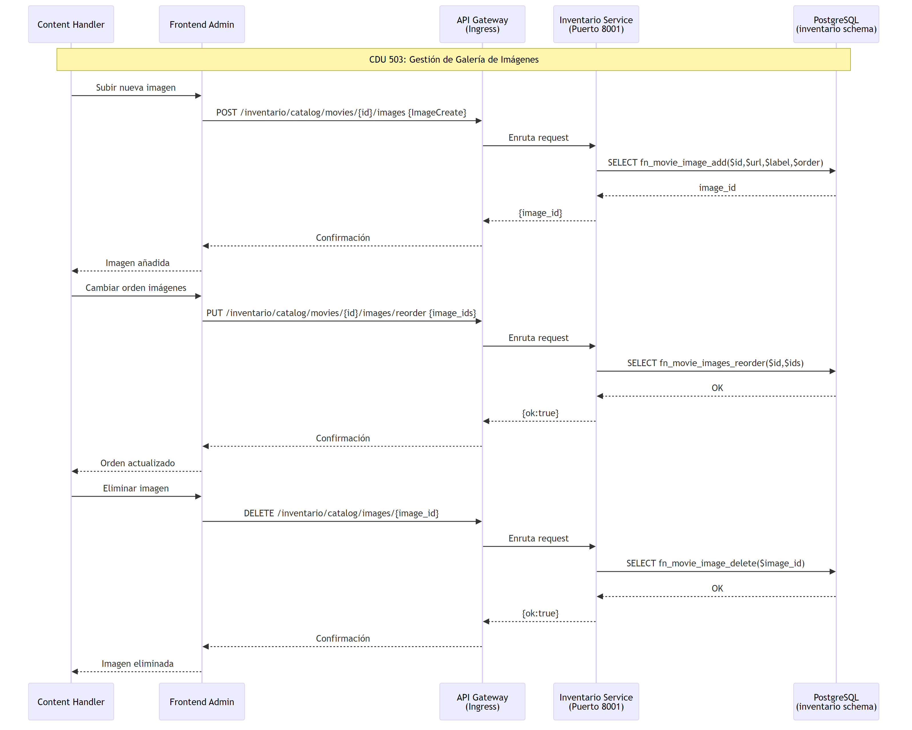

### CDU 504 – Administrar Categorías del Sistema  
*(incluido en CDU 502)*

### CDU 505 – Carga Masiva de Contenido

  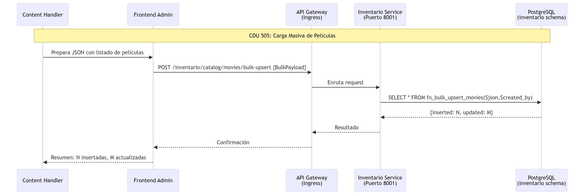

---
