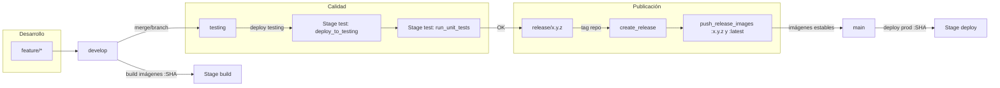

# CI/CD de ChapinFlix SA (GitLab CI/CD + Google Cloud + GKE)

---

## Tabla de contenido

- [CI/CD de ChapinFlix SA (GitLab CI/CD + Google Cloud + GKE)](#cicd-de-chapinflix-sa-gitlab-cicd--google-cloud--gke)
  - [Tabla de contenido](#tabla-de-contenido)
  - [Arquitectura general del pipeline](#arquitectura-general-del-pipeline)
  - [Flujo de ramas (GitFlow) soportado](#flujo-de-ramas-gitflow-soportado)
  - [Variables de entorno de GitLab CI/CD](#variables-de-entorno-de-gitlab-cicd)
  - [Requisitos previos de infraestructura](#requisitos-previos-de-infraestructura)
  - [Stages y jobs](#stages-y-jobs)
    - [Stage **build**](#stage-build)
    - [Stage **test**](#stage-test)
    - [Stage **release**](#stage-release)
    - [Stage **deploy**](#stage-deploy)
  - [Convenciones de versionado e imágenes](#convenciones-de-versionado-e-imágenes)
  - [Endpoints de prueba (testing)](#endpoints-de-prueba-testing)
  - [Diagrama de flujo del pipeline](#diagrama-de-flujo-del-pipeline)
  - [Glosario rápido](#glosario-rápido)
    - [Anexo: correspondencia de recursos](#anexo-correspondencia-de-recursos)

---

## Arquitectura general del pipeline

El pipeline automatiza **build → test → release → deploy** sobre contenedores de varios microservicios y despliega en **Google Kubernetes Engine (GKE)**. Se usan imágenes en **Container Registry/Artifact Registry (GCR)** del proyecto de GCP. El entorno de *testing* vive en el *namespace* `testing` y *producción* en el *namespace* `default`.

Microservicios construidos y desplegados:

* `sa-auth` (Auth)
* `sa-inventario` (Gestión de inventario)
* `sa-usuarios` (Gestión de usuarios)
* `sa-pago` (Pagos/Stripe)
* `sa-vercatalogo` (Ver catálogo)
* `sa-verpeli` (Ver películas)

---

## Flujo de ramas (GitFlow) soportado

* `feature/*` → *Merge* a **`develop`**: dispara **build** (imágenes `:SHA`) para validaciones tempranas.
* **`develop`** / **`testing`** / **`main`**: admitidas por el job de **build** (construcción y *push* de imágenes `:SHA`).
* **`testing`**: dispara **deploy a testing** + **pruebas de salud** (stage **test**).
* **`release/x.y.z`**: dispara stage **release**:

  * crea **git tag** `x.y.z` en el repositorio,
  * retaguea y *pushea* imágenes `:x.y.z` y `:latest` (a partir de `:SHA`).
* **`main`**: dispara **deploy a producción** (stage **deploy**) actualizando los *Deployments* en GKE con imágenes `:SHA` del commit.

---

## Variables de entorno de GitLab CI/CD

Defínanse en **Settings → CI/CD → Variables** (enmascaradas y protegidas cuando aplique). Algunas ya aparecen en el YAML:

| Variable                                               | Descripción                                                                                                                                |
| ------------------------------------------------------ | ------------------------------------------------------------------------------------------------------------------------------------------ |
| `DOCKER_REGISTRY`                                      | Registro de contenedores (p. ej., `gcr.io/chapinflix-sa`).                                                                                 |
| `GCP_PROJECT_ID`                                       | ID del proyecto GCP (p. ej., `chapinflix-sa`).                                                                                             |
| `GKE_CLUSTER_NAME`                                     | Nombre del clúster GKE (p. ej., `chapinflix-cluster`).                                                                                     |
| `GKE_ZONE`                                             | Zona/Región del clúster (p. ej., `us-central1`).                                                                                           |
| `KUBECTL_VERSION`                                      | Versión de kubectl usada por el runner (opcional).                                                                                         |
| `DOCKER_HOST` / `DOCKER_TLS_CERTDIR` / `DOCKER_DRIVER` | Configuración para `docker:dind`.                                                                                                          |
| `GCP_SERVICE_ACCOUNT_KEY`                              | **Clave JSON** del Service Account en **Base64**. Debe cargarse como variable **masked**/**protected** y **no** *hardcodearse* en el YAML. |


---

## Requisitos previos de infraestructura

1. **Proyecto GCP** activo con acceso a **Artifact Registry/Container Registry** y **GKE**.
2. **Service Account** con roles mínimos:

   * `roles/storage.admin` (lectura/escritura en registro de contenedores),
   * `roles/container.admin` o conjunto mínimo equivalente para `get-credentials` y *rollouts*,
   * `roles/artifactregistry.writer` (si usa Artifact Registry).
3. **Clúster GKE** accesible (`gcloud container clusters get-credentials …`) y *namespaces*:

   * `testing` (preproducción),
   * `default` (producción) o el que corresponda en su organización.
4. **Deployments/Services/Ingress** creados previamente en ambos *namespaces*, con *container names* que coincidan con los usados por `kubectl set image`.
5. **GitLab Runner** con tag `saas-linux-small-amd64` y soporte para `docker:dind` en los jobs de build.

---

## Stages y jobs

### Stage **build**

**Jobs:** `test_runner` (sanidad del runner) y `build_images`.

* **`test_runner`** (`only: develop`): verificación rápida del entorno del runner (imagen Alpine) con un `echo`.
* **`build_images`** (`only: develop, testing, main`):

  1. Autenticación en GCP usando la clave del Service Account (`gcloud auth activate-service-account`).
  2. `gcloud auth configure-docker` para *push* a `gcr.io`.
  3. `docker build` y `docker push` de **6 microservicios**, etiquetando **`:$CI_COMMIT_SHA`**:

     * `./backend/Servicios/Auth` → `sa-auth`
     * `./backend/Servicios/Gestion_inventario` → `sa-inventario`
     * `./backend/Servicios/Gestion_users` → `sa-usuarios`
     * `./backend/Servicios/pago` → `sa-pago`
     * `./backend/Servicios/Ver_catalogo` → `sa-vercatalogo`
     * `./backend/Servicios/Ver_peliculas` → `sa-verpeli`

**Resultado esperado:** imágenes de cada servicio en el registro `gcr.io/chapinflix-sa` con la etiqueta `:SHA` del commit.

---

### Stage **test**

**Jobs:** `deploy_to_testing` y `run_unit_tests` (PowerShell sobre Alpine).

* **`deploy_to_testing`** (`only: testing`):

  1. Autenticación en GCP y configuración del plugin de autenticación de GKE (`google-cloud-cli-gke-gcloud-auth-plugin`).

  2. Obtención de credenciales del clúster (`gcloud container clusters get-credentials`).

  3. **Actualización de imágenes** en el *namespace* `testing` usando `kubectl set image` por cada *Deployment* y **rollout** con `kubectl rollout status`.

* **`run_unit_tests`** (`needs: deploy_to_testing`): ejecuta **pruebas de salud HTTP** contra el *host* de testing (nip.io)

  * Base URL: `http://testing.34.10.139.168.nip.io/` por servicio.
  * Verifica endpoints `/health` o raíz `/` y falla el job si la respuesta no es la esperada.

**Resultado esperado:** despliegue en `testing` y todas las verificaciones PASSED.

---

### Stage **release**

**Jobs:** `create_release` y `push_release_images` (`only: /^release\/.*$/`).

* **`create_release`**:

  1. Deriva `VERSION` desde el nombre de la rama `release/x.y.z` → `x.y.z`.
  2. Configura identidad de Git y crea **git tag** `x.y.z` enviado a `origin`.

* **`push_release_images`** (`needs: create_release`):

  1. Autenticación en GCP.
  2. `docker pull` de cada imagen `:$CI_COMMIT_SHA` previamente construida.
  3. Retag a `:$VERSION` y `:latest` para cada microservicio.
  4. *Push* de ambas etiquetas al registro.

**Resultado esperado:** tag de repositorio `x.y.z` y seis imágenes publicadas con etiquetas `x.y.z` y `latest`.

---

### Stage **deploy**

**Jobs:** `deploy_to_production` (auto en `main`) y `cleanup_testing` (manual).

* **`deploy_to_production`** (`only: main`):

  1. Autenticación y acceso al clúster.
  2. Actualiza imágenes **en producción** (*namespace* `default`) a `:$CI_COMMIT_SHA` del commit en `main`.
  3. Valida *rollouts* con `kubectl rollout status` servicio por servicio.

* **`cleanup_testing`** (**manual**, *allow_failure: true*):

  * Limpieza de *pods* `Succeeded` y `Failed` en el *namespace* `testing` para mantener ordenado el entorno.

**Resultado esperado:** producción actualizada *per service* a la imagen del commit de `main`; entorno `testing` sin *pods* huérfanos al ejecutar la limpieza.

---

## Convenciones de versionado e imágenes

* **Etiquetas de build**: siempre `:$CI_COMMIT_SHA` (inmutables por commit).
* **Etiquetas de release**: `:x.y.z` y `:latest`, generadas en ramas `release/x.y.z`.
* **Rollback sugerido**:

  * En producción: `kubectl rollout undo deployment/<svc> -n default` o volver a fijar la imagen a una etiqueta estable (p. ej., `:x.y.z`) y esperar status OK.
  * Para *testing*: mismo mecanismo, pero en `-n testing`.

---

## Endpoints de prueba (testing)

El job `run_unit_tests` comprueba salud sobre *nip.io* (resuelve al IP dado). Endpoints esperados:

* Auth: `http://testing.34.10.139.168.nip.io/auth/health` → `{ status: "healthy" }`
* Usuarios: `http://testing.34.10.139.168.nip.io/ususarios/health` → `{ status: "healthy" }`
* Ver Catálogo: `http://testing.34.10.139.168.nip.io/vercatalogo/health` → `{ status: "healthy" }`
* Ver Películas: `http://testing.34.10.139.168.nip.io/verpeli/health` → `{ status: "healthy" }`
* Pago: `http://testing.34.10.139.168.nip.io/pago/` → cuerpo no vacío (sanidad simple)
* Inventario: previsto, pero sin comprobación explícita en el YAML compartido.

---
Comandos útiles:

```bash
kubectl -n testing get deploy,pods
kubectl -n testing rollout status deployment/auth-service
kubectl -n testing rollout undo deployment/auth-service
kubectl -n default get deploy,pods
kubectl -n default set image deployment/auth-service auth=gcr.io/chapinflix-sa/sa-auth:x.y.z
```

---

## Diagrama de flujo del pipeline



---

## Glosario rápido

* **Runner**: agente que ejecuta los jobs de GitLab CI.
* **`docker:dind`**: Docker-in-Docker para construir imágenes dentro del job.
* **GCR/Artifact Registry**: registro de contenedores en GCP.
* **GKE**: Google Kubernetes Engine (clúster Kubernetes gestionado).
* **Rollout**: proceso de actualización de *Pods* tras cambiar la imagen de un Deployment.
* **nip.io**: DNS wildcard que mapea subdominios a una IP para pruebas rápidas.

---

### Anexo: correspondencia de recursos

| Servicio      | Imagen                                | Deployment (namespace)               | Container name esperado |
| ------------- | ------------------------------------- | ------------------------------------ | ----------------------- |
| Auth          | `gcr.io/chapinflix-sa/sa-auth`        | `auth-service` (`testing`/`default`) | `auth`                  |
| Inventario    | `gcr.io/chapinflix-sa/sa-inventario`  | `inventario-service`                 | `inventario`            |
| Usuarios      | `gcr.io/chapinflix-sa/sa-usuarios`    | `ususarios-service` (verificar)      | `ususarios` (verificar) |
| Pago          | `gcr.io/chapinflix-sa/sa-pago`        | `pago-service`                       | `sa-pago`               |
| Ver Catálogo  | `gcr.io/chapinflix-sa/sa-vercatalogo` | `vercatalogo-service`                | `vercatalogo`           |
| Ver Películas | `gcr.io/chapinflix-sa/sa-verpeli`     | `verpeli-service`                    | `verpeli`               |
