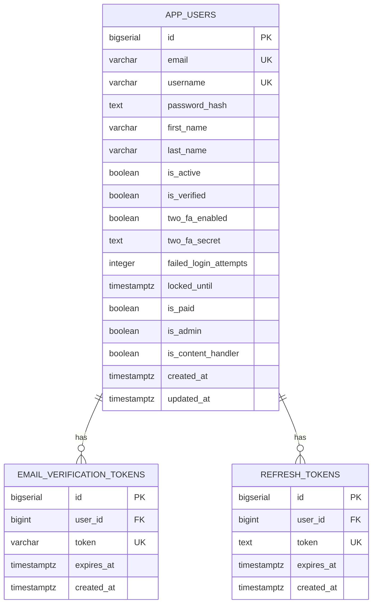

# Base de Datos – ChapinFlix (Relacional + No Relacional)

ChapinFlix usa **dos almacenes de datos**:

* **PostgreSQL (Supabase)** para identidad, autenticación y estado comercial.
* **MongoDB Atlas** para catálogo de películas, taxonomía y telemetría de consumo.

**Stripe** es la fuente de verdad de suscripciones; el flag local `is_paid` se sincroniza vía **webhooks**. Los vídeos se almacenan **fuera** de la BD (ej. blob storage/CDN) y solo se guardan rutas o URLs.

---

## Diseño General

### Relacional (Supabase / PostgreSQL)

* **Schema `app`** → gestión de usuarios, seguridad y flags de cuenta.

### No Relacional (MongoDB Atlas)

* **Catálogo** → `movies`, `categories`, `movie_images` opcional.
* **Personalización y uso** → `view_history`, `user_lists`.

> No hay FKs físicas entre Postgres y Mongo. La unión se hace por `user_id` y por `movie_id` o `slug` en la capa de servicios.

---

## Schema relacional `app` (Supabase)

### Tablas

* `app.app_users` → Cuenta, roles, 2FA y estados comerciales.
* `app.email_verification_tokens` → Tokens de verificación de correo.
* `app.refresh_tokens` → Tokens de refresh de sesión.

### ER (Mermaid)



### Seguridad

* **RLS activado** en las tres tablas.
* En dev: políticas permisivas `USING true`. En prod: funciones `SECURITY DEFINER`, vistas y roles con privilegios mínimos.

### Índices

* `app_users`: únicos por `email` y `username`.
* `email_verification_tokens`: índice por `token`.
* `refresh_tokens`: índices por `token` y `user_id`.

---

## Almacenamiento no relacional (MongoDB Atlas)

### Colecciones

#### `movies`

* Clave natural `slug` único. Incluye metadatos de disponibilidad, clasificación, categorías y galería embebida.

**Campos típicos:** `movie_id`, `title`, `slug`, `classification_code`, `duration_minutes`, `is_free`, `available_from`, `available_until`, `categories`, `images`, `video_blob_path`, `video_url`.

**Índices sugeridos:**

* `{ slug: 1 }` único
* `{ is_free: 1, available_from: 1, available_until: 1 }`
* `{ categories: 1, available_from: 1 }`

#### `categories`

* `category_id`, `name`, `slug` único, `parent_id` opcional.

**Índices:** `{ slug: 1 }` único, `{ parent_id: 1 }`.

#### `movie_images` (opcional si no embebes en `movies`)

* `movie_id`, `url`, `kind`, `position`.

**Índices:** `{ movie_id: 1, position: 1 }`.

#### `view_history`

* Telemetría de reproducciones: `user_id`, `movie_id`, `last_viewed`, `watch_count`, `progress_seconds`.

**Índices:** `{ user_id: 1, last_viewed: -1 }`, `{ user_id: 1, movie_id: 1 }`.

#### `user_lists`

* Watchlist o favoritos: un doc por `user_id` y `type`.

**Índice compuesto:** `{ user_id: 1, type: 1 }` único.

---

## Conexiones lógicas entre stores

* `app.app_users.id` ↔ `user_id` en Mongo.
* `movies.slug` ↔ rutas de catálogo y validaciones de acceso.
* `view_history` y `user_lists` referencian `user_id` y `movie_id` o `slug`.

> La consistencia se mantiene en servicios: antes de insertar en Mongo se valida existencia y reglas de negocio.

---

## Pagos y sincronización (Stripe)

* Stripe Subscriptions es la **fuente de verdad**.
* El webhook actualiza `app.app_users.is_paid` según estado `active` o `trialing`.
* No se guardan PAN o tarjetas en la BD local.

---

## JSON de ejemplo para diagramar en JSON Crack

### `movies`

```json
{
  "movie_id": "e3f4d2ab-6b7e-4d30-9b11-2d2d5c7f2a10",
  "title": "El Viaje de Ana",
  "slug": "el-viaje-de-ana",
  "classification_code": "PG-13",
  "duration_minutes": 112,
  "is_free": false,
  "available_from": "2025-09-01T00:00:00Z",
  "available_until": "2026-03-01T00:00:00Z",
  "categories": ["aventura", "drama"],
  "images": [
    { "url": "https://cdn.example.com/posters/el-viaje-de-ana.jpg", "kind": "poster", "position": 1 },
    { "url": "https://cdn.example.com/banners/el-viaje-de-ana.jpg", "kind": "banner", "position": 2 }
  ],
  "video_blob_path": "e3f4d2ab-6b7e-4d30-9b11-2d2d5c7f2a10.mp4",
  "video_url": null
}
```

### `categories`

```json
{
  "category_id": "7",
  "name": "Aventura",
  "slug": "aventura",
  "parent_id": null
}
```

### `view_history`

```json
{
  "user_id": 123,
  "movie_id": "e3f4d2ab-6b7e-4d30-9b11-2d2d5c7f2a10",
  "last_viewed": "2025-09-24T09:45:00Z",
  "watch_count": 3,
  "progress_seconds": 1480
}
```

### `user_lists` (watchlist)

```json
{
  "user_id": 123,
  "type": "watchlist",
  "items": [
    "e3f4d2ab-6b7e-4d30-9b11-2d2d5c7f2a10",
    "d5a1c9f8-0b77-47c2-9a3a-1c1b0d4f77aa"
  ],
  "updated_at": "2025-09-23T18:22:00Z"
}
```

---

## Notas de diseño

* **Normalización**: Postgres en 3NF. Mongo embebe lo que se lee junto y separa telemetría.
* **Índices**: claves únicas por `email`, `username`, `slug`; compuestos en `view_history` y `user_lists`.
* **Seguridad**: RLS, funciones `SECURITY DEFINER`, mínimos privilegios.
* **Escalabilidad**: `BIGSERIAL` en usuarios; `movie_id` como UUID o ULID en Mongo; índices por ventana de disponibilidad.

---

## Conclusión

Diseño híbrido que separa identidad y catálogo, con sincronización de pagos vía Stripe y modelos óptimos para consultas de lectura intensiva en catálogo y telemetría.
