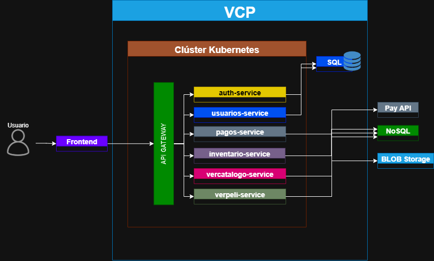
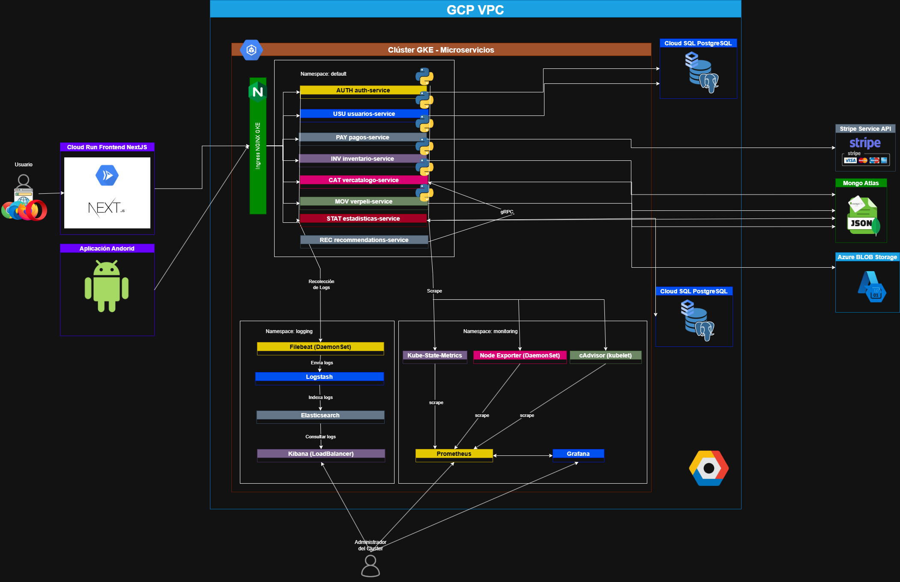

# Especificación de Requisitos - Sistema Chapinflix

## Casos de uso

### Caso de uso de Alto nivel

  

---

### Caso de uso primera descomposición

  

---

### CUN 100 Autenticación

  

---

### CUN 200 Ver catálogo

  

---

### CUN 300 Ver película

  

---

### CUN 400 Gestionar Usuarios

  

---

### CUN 500 Gestionar Catálogo

  

### CUN 600 Gestionar Pagos

  

---

[Ver detalle de casos de uso](CDU/README.md)

---

## Diagramas

### Arquitectura General

### Diagrama Entidad-Relación

[ER](ER/README.md)

---

## Explicación de servicios

[Autenticación](SERVICES/auth.md)

[Catálogo](SERVICES/catalogo.md)

[Inventario](SERVICES/inventario.md)

[Pago](SERVICES/pagos.md)

[Pelicula](SERVICES/peliculas.md)

[Usuarios](SERVICES/usuarios.md)

## Metodología Ágil

[Metodología Ágil](meta.md)

## CI-CD

[CI-CD](CI-CD.md)

## Versionamiento

[Usuarios](Versionamiento.md)