# Microservicio de Autenticación

Servicio de autenticación y gestión de cuentas construido con **FastAPI** y **SQLAlchemy**, diseñado para operar dentro de un **cluster de Kubernetes en Google Cloud Platform (GCP)**. Expone capacidades de registro, verificación de correo, inicio de sesión con **JWT** (access/refresh) y **2FA TOTP**, con almacenamiento en **PostgreSQL (Cloud SQL)**. El frontend consume este servicio desde **Google Cloud Run**. En el ecosistema existen otros microservicios que usan **MongoDB Atlas**, y servicios externos como **Stripe** (pagos) y **Azure Blob Storage** (archivos), los cuales se integran a nivel de plataforma y no directamente en este módulo.

---

## Objetivos

* Proveer autenticación robusta basada en **JWT** con **access tokens** de corta duración y **refresh tokens** persistidos en base de datos.
* Habilitar **verificación de correo** mediante SMTP (Gmail) y **autenticación multifactor (2FA)** con códigos TOTP.
* Ofrecer un diseño listo para **contenedorización** y despliegue en **Kubernetes** en GCP, con CORS habilitado para el frontend en Cloud Run.

---

## Arquitectura Lógica

* **FastAPI** como framework web.
* **SQLAlchemy ORM** para acceso a datos y **PostgreSQL** en **Cloud SQL** como almacén de identidad y tokens.
* **JWT (HS256)** para emisión/validación de access/refresh tokens.
* **Cookies HttpOnly** para entregar tokens a clientes web (con `SameSite` y `Secure` configurables por entorno).
* **2FA TOTP** con generación de secretos y QR para enrolamiento.
* **Gmail SMTP** para envío de correos de verificación.
* **AES-256-CBC** utilitario para cifrado de datos sensibles (cuando aplique).

> Nota: Aunque en la plataforma existen Stripe y Azure Blob Storage, este microservicio no los consume de forma directa; la interacción ocurre en otros módulos del sistema.

---

## Componentes Principales

* **Configuración (`config.py`)**: Carga tipada de variables de entorno (Pydantic Settings) para base de datos, JWT, SMTP, políticas de seguridad y claves de cifrado.
* **Capa de Datos (`database.py`, `models.py`)**: Definición de `engine`, `SessionLocal` y modelos `User`, `EmailVerificationToken`, `RefreshToken` en esquema `app`.
* **Seguridad y Autenticación (`auth.py`, `security.py`)**:

  * Hash de contraseñas (bcrypt) y verificación.
  * Emisión de **access**/**refresh** tokens, validación y gracia para refresh expirado.
  * Extracción de tokens desde **cookies** o cabecera **Authorization: Bearer**.
  * **2FA TOTP**: generación de secreto, QR base64 y verificación con ventana de tolerancia.
  * Gestión de cookies `HttpOnly`, `SameSite`, `Secure` según entorno.
* **Correo (`email_service.py`)**: Envío de email de verificación vía Gmail SMTP (SSL 465) con contenido HTML y fallback a consola para desarrollo.
* **Criptografía (`crypto.py`)**: Utilitario **AES-256-CBC** con PKCS#7 para cifrado/descifrado (IV aleatorio embebido en el payload base64).
* **Aplicación (`main.py`)**: Inicializa FastAPI, habilita CORS, monta los routers de autenticación y expone `/health`.

---

## Esquema de Datos (resumen)

**User (app.app\_users)**

* Identidad: `id`, `email`, `username`
* Estado: `is_active`, `is_verified`, `is_paid`, `is_admin`, `is_content_handler`
* Seguridad: `password_hash`, `two_fa_enabled`, `two_fa_secret`, `failed_login_attempts`, `locked_until`
* Trazabilidad: `created_at`, `updated_at`

**EmailVerificationToken (app.email\_verification\_tokens)**

* `user_id`, `token`, `expires_at`, `created_at`

**RefreshToken (app.refresh\_tokens)**

* `user_id`, `token` (persistido), `expires_at`, `created_at`

---

## Flujos Clave

### Registro de usuario

1. El cliente envía email, username, password y datos de perfil.
2. El servicio valida, hashea la contraseña y crea el usuario en estado no verificado.
3. Se genera un `EmailVerificationToken` y se envía un correo con enlace de verificación.

### Verificación de correo

1. El usuario hace clic en el enlace; el servicio valida el token y su vigencia.
2. Se marca el usuario como verificado (`is_verified = true`).

### Inicio de sesión + 2FA (opcional)

1. El usuario envía `username` y `password`.
2. Si las credenciales son válidas y la cuenta no está bloqueada, se valida 2FA si está habilitado:

   * Si 2FA está activo, el cliente provee `totp_code`; se verifica el código.
3. Se emiten **access** y **refresh** tokens y se configuran como **cookies HttpOnly**.

### Renovación de tokens (refresh)

1. El cliente envía el **refresh token** (cookie o body, según endpoint).
2. Se valida firma y tipo, se comprueba persistencia y vigencia en BD.
3. Se emiten nuevos tokens y se actualizan cookies. Existe una **gracia** limitada tras expiración del refresh.

### Cierre de sesión

1. Se invalida/elimina el refresh token persistido para esa sesión.
2. Se limpian cookies en el cliente.

---

## Endpoints (referencia general)

> La definición exacta de rutas se encuentra en los routers de autenticación. A modo orientativo, el módulo expone patrones como:

* `POST /auth/register` – Registro de usuario y envío de verificación.
* `GET  /auth/verify-email?token=...` – Verificación de correo.
* `POST /auth/login` – Login (acepta `totp_code` si 2FA está activo).
* `POST /auth/enable-2fa` – Habilita 2FA y devuelve `secret` + `qr_code` base64.
* `POST /auth/verify-2fa` – Verifica enrolamiento 2FA.
* `POST /auth/refresh` – Renueva tokens.
* `POST /auth/logout` – Revoca refresh token de la sesión actual.
* `GET  /me` – Perfil autenticado (protección vía `JWTBearer`).

---

## Configuración por Entorno (.env)

Variables principales (nombres ilustrativos):

* **Base de datos**

  * `DATABASE_URL` – cadena de conexión a PostgreSQL (Cloud SQL).
* **JWT**

  * `SECRET_KEY`, `ALGORITHM=HS256`, `ACCESS_TOKEN_EXPIRE_MINUTES`, `REFRESH_TOKEN_EXPIRE_DAYS`, `REFRESH_TOKEN_GRACE_PERIOD_HOURS`.
* **Correo (Gmail SMTP)**

  * `SMTP_HOST=smtp.gmail.com`, `SMTP_PORT=465`, `SMTP_USER`, `SMTP_PASS` (app password), `EMAIL_FROM`, `EMAIL_FROM_NAME`.
* **Cookies/Seguridad**

  * `COOKIE_SECURE` (true en HTTPS), `COOKIE_SAMESITE` (`none` para front en dominio distinto), `MAX_LOGIN_ATTEMPTS`, `LOCKOUT_DURATION_MINUTES`.
* **Cifrado**

  * `AES_KEY` (32 bytes efectivos para AES-256).

> Importante: Si `SameSite=none`, `Secure` debe ser `true` por política de navegador.

---

## Despliegue en GCP

* **Contenedor**: Construir imagen (Dockerfile) y publicar en Artifact Registry.
* **Kubernetes (GKE)**: Desplegar `Deployment` y `Service` tipo `ClusterIP` detrás de un **Ingress** con TLS. Injectar secretos (JWT, SMTP, AES, credenciales DB) vía **Secrets** y usar **ConfigMaps** para banderas no sensibles.
* **Base de datos**: Conectar a **Cloud SQL PostgreSQL** usando **Cloud SQL Auth Proxy** o `Private IP` desde el cluster. Aplicar migraciones/DDL del esquema `app`.
* **Frontend**: **Cloud Run** consume el dominio del Ingress; configurar CORS y cookies `Secure`/`SameSite`.
* **Logging/Monitoreo**: Exportar métricas a **Cloud Monitoring** y logs a **Cloud Logging**. Health check: `GET /health`.

---

## Consideraciones de Seguridad

* **Almacenamiento de contraseñas**: Hash con bcrypt; nunca almacenar en texto plano.
* **Tokens**: Access de corta vida; Refresh persistido con expiración y posibilidad de revocación por sesión.
* **Cookies**: `HttpOnly`, `Secure` en producción, `SameSite` adecuado a topología (Cloud Run en dominio distinto → `none`).
* **Brute force / Lockout**: Uso de `failed_login_attempts` y `locked_until` para mitigar ataques.
* **2FA**: Recomendado habilitar TOTP para roles sensibles.
* **Criptografía**: AES-256-CBC con IV aleatorio; proteger y rotar `AES_KEY` y `SECRET_KEY`.

---

## Secuencia de Interacción (alto nivel)

```mermaid
sequenceDiagram
    autonumber
    participant FE as Frontend (Cloud Run)
    participant AUTH as Auth Service (FastAPI en GKE)
    participant PG as PostgreSQL (Cloud SQL)
    participant SMTP as Gmail SMTP
    participant STR as Stripe (ecosistema)
    participant AZ as Azure Blob (ecosistema)

    rect rgb(245,245,245)
    note over FE,AUTH: Registro de usuario
    FE->>AUTH: POST /auth/register {email, username, password, ...}
    AUTH->>PG: INSERT User, INSERT EmailVerificationToken
    AUTH-->>SMTP: Envío email de verificación (link)
    SMTP-->>FE: Correo con enlace
    end

    rect rgb(245,245,245)
    note over FE,AUTH: Verificación de correo
    FE->>AUTH: GET /auth/verify-email?token=...
    AUTH->>PG: SELECT/UPDATE token y usuario (is_verified=true)
    AUTH-->>FE: 200 OK
    end

    rect rgb(245,245,245)
    note over FE,AUTH: Login + 2FA opcional
    FE->>AUTH: POST /auth/login {username, password, totp_code?}
    AUTH->>PG: SELECT User / validaciones & lockout
    alt 2FA habilitado
        AUTH->>AUTH: Validación TOTP
    end
    AUTH-->>FE: Set-Cookie access_token &#59; Set-Cookie refresh_token
    end

    rect rgb(245,245,245)
    note over FE,AUTH: Refresh token
    FE->>AUTH: POST /auth/refresh (cookie/body)
    AUTH->>PG: SELECT RefreshToken (vigente)
    AUTH-->>FE: Nuevas cookies JWT
    end

    rect rgb(245,245,245)
    note over FE,AUTH: Logout
    FE->>AUTH: POST /auth/logout
    AUTH->>PG: DELETE/Invalidate RefreshToken
    AUTH-->>FE: 204 No Content
    end
```

