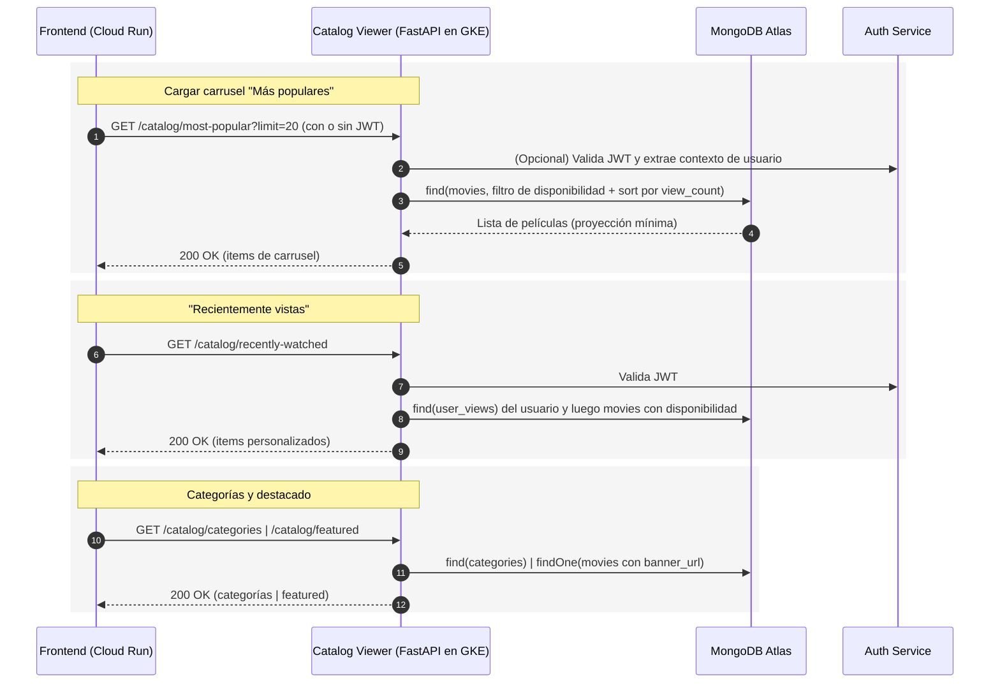

# Microservicio de Visualización de Catálogo

Este microservicio expone una API optimizada para **consultar y presentar el catálogo de películas** de la plataforma Chapinflix. Está desarrollado con **FastAPI** y preparado para ejecutarse en un **cluster de Kubernetes en Google Cloud Platform (GCP)**. Provee endpoints para carruseles (más populares, recién agregadas, recientemente vistas, ver otra vez), categorías, y una pieza destacada (featured), aplicando reglas de disponibilidad y visibilidad.

En el ecosistema:

* El **frontend** (desplegado en **Google Cloud Run**) consume esta API.
* La **autenticación** se realiza mediante **JWT** emitidos por el servicio de autenticación, consumidos por un middleware que permite endpoints con sesión opcional.
* El **catálogo** se obtiene desde **MongoDB Atlas** (películas y categorías).
* Otros microservicios gestionan la **ingesta** y la **gestión** del contenido (este servicio es de solo lectura para el usuario final).

---

## Objetivos

* Ofrecer endpoints performantes para construir vistas tipo carrusel y secciones editoriales.
* Aplicar reglas de disponibilidad: `is_active`, `available_from`, `available_until` (incluyendo TZ y fechas conscientes).
* Permitir personalización basada en el usuario (p. ej., recientemente vistas y ver otra vez), cuando hay sesión.
* Exponer datos mínimos requeridos para una UI responsiva (proyecciones ligeras).

---

## Arquitectura Lógica

* **FastAPI** + **CORS** para consumo desde Cloud Run.
* **Middleware JWT** (autenticación opcional) para enriquecer las consultas con contexto de usuario cuando aplica.
* **MongoDB Atlas** como almacén principal del catálogo.
* **Utilidades** de disponibilidad y proyección para consultas eficientes.

---

## Componentes Principales

* **Autenticación (middleware)**: analiza el JWT (cookie o header) y crea un contexto opcional de usuario. El consumo es opcional: endpoints públicos pueden usarlo para personalización.
* **Conexión Mongo**: inicialización de cliente, base de datos y creación de índices (únicos, de texto, por campos de consulta frecuentes).
* **Utils de catálogo**: filtros de disponibilidad, proyecciones mínimas para carruseles, utilidades de tiempo.
* **Router `catalog_viewer`**: endpoints de lectura para carruseles, categorías, pieza destacada y listados por categoría. Implementa ordenamientos y límites configurables.

---

## Reglas de Disponibilidad

Toda consulta de catálogo aplica un filtro común:

* `is_active = true`.
* `available_from`: nulo o menor/igual a `now()`.
* `available_until`: nulo o mayor/igual a `now()`.
* Las fechas se manejan como conscientes de zona horaria (UTC) para evitar inconsistencias.

---

## Endpoints (Resumen)

* `GET /catalog/most-popular?limit=20`
  Ordena por `stats.view_count` desc, luego `view_count` desc y `created_at` desc. Devuelve items para carrusel.

* `GET /catalog/top-15`
  Igual a **most-popular** pero con límite fijo de 15.

* `GET /catalog/recently-added?limit=20`
  Ordena por `created_at` desc.

* `GET /catalog/recently-watched?limit=20`
  Requiere sesión. Usa colección `user_views` si existe para devolver las más recientemente vistas por el usuario, respetando disponibilidad.

* `GET /catalog/watch-again?limit=20`
  Requiere sesión. Usa `user_views` con `count > 1` y ordena por `last_viewed` desc.

* `GET /catalog/categories`
  Devuelve categorías activas con `name`, `slug` y jerarquía.

* `GET /catalog/category/{slug}?limit=20&offset=0`
  Lista de películas por categoría (orden `created_at` desc), respetando disponibilidad.

* `GET /catalog/featured`
  Devuelve una película destacada con `banner_url` (si disponible), priorizando las más recientes.

> Todos los endpoints retornan modelos Pydantic específicos para la UI (items de carrusel, featured, categorías), con campos como `title`, `slug`, `poster_url`, `classification_code`, `duration_minutes`, `is_free`, contadores (`view_count`, `watch_count`) y marcas de tiempo (`upload_date`, `last_viewed`) cuando existan.

---

## Variables de Entorno (.env)

* `MONGO_URI` – Cadena de conexión a MongoDB Atlas.
* `MONGO_DB` – Nombre de la base de datos (por defecto `chapinflix_content`).
* `AUTH_SECRET_KEY` – Clave compartida para validar JWT (algoritmo HS256 por defecto).
* `DATABASE_URL` – Opcional, si se habilitan funciones auxiliares que lean de PostgreSQL.

---

## Despliegue en GCP

* **Imagen**: construir con Docker y publicar en Artifact Registry.
* **GKE**: desplegar como Deployment/Service y exponer mediante Ingress con TLS.
* **Secrets**: inyectar credenciales de MongoDB y `AUTH_SECRET_KEY`.
* **Observabilidad**: integrar con Cloud Logging/Monitoring. Considerar métricas de latencia y recuento de ítems.

---

## Consideraciones de Seguridad

* Endpoints públicos con autenticación **opcional**: no exponen datos sensibles; personalización solo si hay JWT válido.
* Validación estricta de parámetros (`limit`, `offset`, `slug`).
* Filtro de disponibilidad obligatorio en todas las consultas.
* Separación de responsabilidades: este servicio **no** realiza cargas ni modificaciones de contenido.

---

## Secuencia de Interacción (alto nivel)

