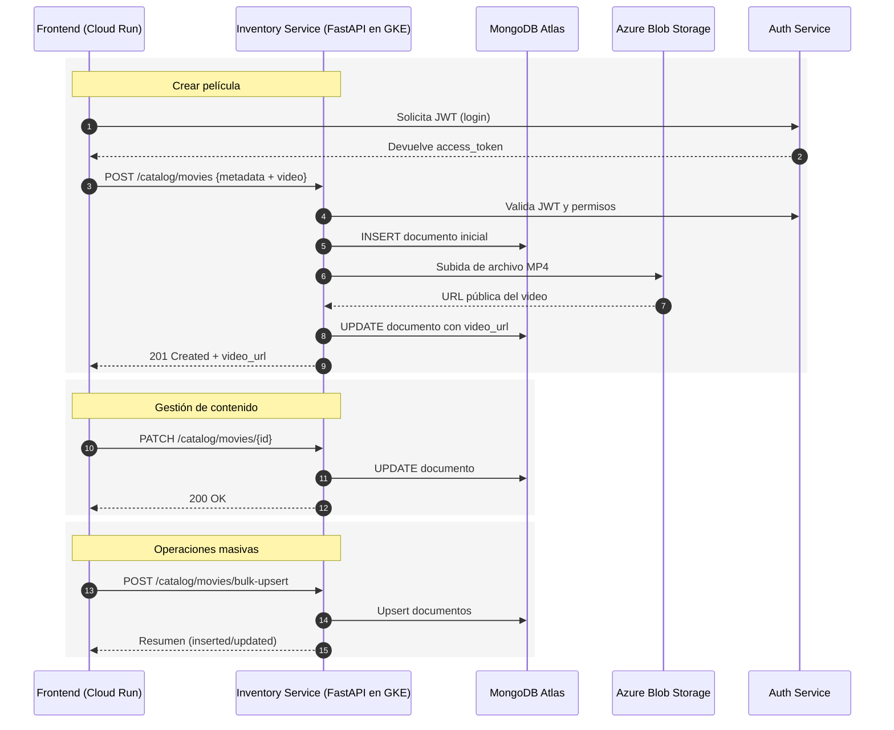

# Microservicio de Gestión de Catálogo y Contenidos

Este microservicio implementa la **gestión integral de catálogo de películas** dentro de la plataforma Chapinflix. Está construido con **FastAPI** y diseñado para operar en un **cluster de Kubernetes en Google Cloud Platform (GCP)**. Expone capacidades para la administración completa del catálogo de contenido: creación de películas con metadatos, carga directa de archivos de video a **Azure Blob Storage**, clasificación por categorías, gestión de imágenes y sincronización con bases de datos relacionales y no relacionales.

En el ecosistema general, este servicio se comunica con:

* **Microservicio de Autenticación** (JWT) para autorización.
* **PostgreSQL (Cloud SQL)** para persistencia relacional en otros módulos.
* **MongoDB Atlas** como base principal para el catálogo de contenido.
* **Azure Blob Storage** para almacenamiento de archivos multimedia.
* **Google Cloud Run** para el frontend que consume este servicio.
* **Stripe** (servicio de pagos) de manera indirecta a través de otros componentes.

---

## Objetivos

* Permitir la creación, actualización, categorización y eliminación de películas.
* Integrar un flujo automatizado para subir y almacenar videos directamente en Azure Blob Storage.
* Gestionar categorías y relaciones jerárquicas para facilitar la navegación del catálogo.
* Controlar acceso y privilegios mediante **JWT** y roles definidos desde el microservicio de autenticación.
* Exponer una API lista para integrarse en arquitecturas de microservicios dentro de GCP.

---

## Arquitectura Lógica

* **FastAPI** como framework para la API REST.
* **MongoDB Atlas** como base de datos principal para películas, categorías e imágenes.
* **Azure Blob Storage** para almacenamiento de videos en formato MP4.
* **JWT** validado desde el microservicio de autenticación para controlar el acceso.
* **CORS** habilitado para permitir comunicación con el frontend en **Cloud Run**.
* **AsyncIO + Motor** para consultas asíncronas con MongoDB.

---

## Componentes Principales

* **`authkit.py`** – Middleware de autenticación basado en JWT. Permite validar el contexto del usuario (`paid`, `admin`, `content_handler`) y restringir rutas a roles específicos. 【44†authkit.py†L1-L100】
* **`db_mongo.py`** – Conexión y configuración de **MongoDB Atlas**, creación de índices únicos y de texto para búsquedas eficientes sobre títulos y sinopsis. 【47†db\_mongo.py†L1-L40】
* **`azure_movies_blob.py`** – Cliente para subir archivos MP4 directamente a Azure Blob Storage y devolver su URL pública. 【45†azure\_movies\_blob.py†L30-L80】
* **`routers/cataog.py`** – Núcleo funcional de la API. Incluye endpoints para:

  * Crear películas con metadatos.
  * Subir videos a Azure.
  * Actualizar o eliminar contenido.
  * Gestionar categorías e imágenes.
  * Ejecutar operaciones masivas de **bulk upsert**. 【51†routers/cataog.py†L1-L60】
* **`schemas.py`** – Definición de modelos Pydantic para validación de payloads (creación, actualización, imágenes, categorías, etc.). 【50†schemas.py†L1-L60】
* **`utils.py`** – Funciones auxiliares para conversión de fechas, manejo de `ObjectId` y timestamps UTC. 【49†utils.py†L1-L20】
* **`main.py`** – Inicialización del servicio, registro de routers, configuración de CORS y conexión a MongoDB. 【48†main.py†L1-L20】

---

## Flujos Clave

### Creación de Película con Carga Directa a Azure

1. El cliente realiza un `POST /catalog/movies` con metadatos y el archivo MP4.
2. El servicio valida el JWT y permisos (`content_handler`).
3. Inserta un documento inicial en MongoDB con los metadatos.
4. Sube el archivo a **Azure Blob Storage** usando el `_id` del documento como nombre del blob.
5. Actualiza el documento con la URL pública del video.

### Actualización y Parches

* Permite actualizaciones parciales mediante `PATCH /catalog/movies/{movie_id}`.
* Se puede cambiar disponibilidad (`available_from` / `available_until`), visibilidad (`is_active`), gratuidad (`is_free`), imágenes o categorías.

### Gestión de Categorías

* Crear, actualizar o eliminar categorías.
* Asociar películas a categorías específicas o reemplazar todas las categorías de una película.

### Bulk Upsert

* Permite inserción o actualización masiva de películas mediante `POST /catalog/movies/bulk-upsert`.

---

## Endpoints Principales (Resumen)

* `POST /catalog/movies` – Crear película y subir video.
* `PATCH /catalog/movies/{movie_id}` – Actualizar metadatos.
* `PUT /catalog/movies/{movie_id}/active` – Cambiar estado activo.
* `PUT /catalog/movies/{movie_id}/availability` – Actualizar disponibilidad.
* `PUT /catalog/movies/{movie_id}/is-free` – Cambiar gratuidad.
* `PUT /catalog/movies/{movie_id}/categories` – Reemplazar categorías.
* `POST /catalog/movies/bulk-upsert` – Upsert masivo.
* `POST /catalog/categories` – Crear categoría.
* `PATCH /catalog/categories/{category_id}` – Actualizar categoría.
* `DELETE /catalog/categories/{category_id}` – Eliminar categoría.

---

## Variables de Entorno (.env)

* `DATABASE_URL` – Conexión a PostgreSQL (si aplica en otros módulos).
* `MONGO_URI` – Conexión a MongoDB Atlas.
* `CONNECTION_STRING` – Cadena de conexión para Azure Blob Storage.
* `AZURE_MOVIES_CONTAINER` – Nombre del contenedor de videos.
* `AUTH_SECRET_KEY` – Clave compartida para validación de JWT.

---

## Despliegue en GCP

* **Contenedor**: Construir imagen Docker y desplegar en **GKE**.
* **MongoDB Atlas**: Conexión segura mediante TLS y credenciales en `Secrets`.
* **Azure Blob Storage**: Configurar contenedor `movies` con acceso privado o SAS.
* **Frontend (Cloud Run)**: Consumir los endpoints del servicio.

---

## Consideraciones de Seguridad

* Validación estricta de **JWT** y permisos para cada endpoint.
* Control de acceso basado en roles (`content_handler`, `admin`).
* Validación de tipo MIME y extensión para archivos subidos.
* Manejo de excepciones y rollback en caso de fallos de subida.
* Configuración de índices únicos y textuales en MongoDB para evitar duplicados.

---

## Secuencia de Interacción (Alto Nivel)

