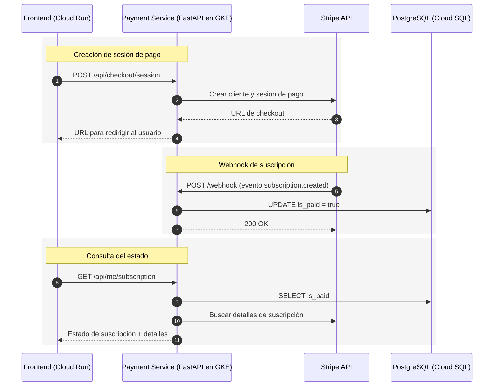

# Microservicio de Pagos y Suscripciones

Este microservicio gestiona el ciclo completo de pagos y suscripciones de usuarios dentro de la plataforma Chapinflix. Está desarrollado en **FastAPI** y se despliega en un **cluster de Kubernetes en Google Cloud Platform (GCP)**. Su principal responsabilidad es la integración con **Stripe** para la creación de clientes, sesiones de pago, suscripciones recurrentes y la sincronización del estado de pago con la base de datos interna.

En el ecosistema global, este servicio se comunica con:

* **Microservicio de Autenticación** para validar tokens JWT y obtener el contexto del usuario.
* **PostgreSQL (Cloud SQL)** para la persistencia del estado de suscripción.
* **Frontend en Cloud Run** para iniciar flujos de pago y consultar estados.
* **Webhook de Stripe** para actualizar automáticamente el estado de pago en la base de datos.

---

## Objetivos

* Integrar el sistema de pagos con **Stripe** para manejar suscripciones recurrentes.
* Crear clientes, precios, sesiones de pago y suscripciones.
* Sincronizar el estado `is_paid` de los usuarios en la base de datos interna.
* Proveer endpoints para consulta del estado de suscripción y cancelación.
* Exponer un webhook seguro que actualice el estado de pago basado en eventos de Stripe.

---

## Arquitectura Lógica

* **FastAPI** como framework de la API.
* **Stripe API** para procesamiento de pagos y suscripciones.
* **PostgreSQL (Cloud SQL)** para almacenamiento del estado de pago de los usuarios.
* **JWT** para autenticar solicitudes y asociar pagos con usuarios.
* **Webhook** para sincronización automática de estados.
* **CORS** habilitado para el frontend en **Cloud Run**.

---

## Componentes Principales

* **`authkit.py`** – Middleware de autenticación JWT. Permite obtener el contexto del usuario y asegurar que solo usuarios autenticados puedan consultar o modificar suscripciones. 【79†authkit.py†L1-L100】
* **`db.py`** – Configuración y manejo del pool de conexiones a **PostgreSQL**. Se utiliza para actualizar el campo `is_paid` en la tabla `app_users`. 【78†db.py†L1-L40】
* **`main.py`** – Núcleo del servicio. Contiene la lógica de creación de clientes, sesiones de pago, cancelación de suscripciones, consultas de estado y webhook. 【77†main.py†L1-L100】

---

## Flujos Clave

### Creación de Sesión de Pago (Checkout)

1. El cliente solicita `POST /api/checkout/session` con su email y username.
2. El servicio valida el JWT (si está presente) y busca o crea un cliente en Stripe.
3. Se crea una sesión de checkout asociada a un precio y al usuario.
4. El frontend redirige al usuario a la URL de pago devuelta por la API.

### Actualización Automática del Estado de Pago

* Stripe envía un evento al webhook (`/webhook`) al crearse, actualizarse o eliminarse una suscripción.
* El servicio obtiene el `user_id` desde `metadata` y actualiza el campo `is_paid` en la base de datos.
* Estados relevantes: `active`, `trialing` (pagado) o cualquier otro (no pagado).

### Consulta del Estado de Suscripción

* El usuario autenticado puede consultar su estado de pago en `GET /api/me/subscription`.
* La API devuelve si tiene una suscripción activa (`has_active_subscription`) y, de ser posible, detalles de la suscripción desde Stripe.

### Cancelación de Suscripción

* Permite cancelar una suscripción existente mediante `POST /api/subscriptions/cancel`, marcando el fin al final del periodo actual.

---

## Endpoints Principales

* `GET /api/stripe/config` – Devuelve las claves públicas y el ID del producto.
* `POST /api/customers/create` – Crea un cliente en Stripe.
* `GET /api/prices` – Obtiene o crea precios para el producto.
* `POST /api/checkout/session` – Crea una sesión de pago de suscripción.
* `POST /api/subscriptions/create` – Crea una suscripción directamente.
* `GET /api/subscriptions/{id}` – Consulta el estado de una suscripción.
* `POST /api/subscriptions/cancel` – Cancela una suscripción.
* `GET /api/subscriptions/check/{email}` – Verifica si un email tiene suscripción activa.
* `GET /api/me/subscription` – Consulta el estado actual del usuario autenticado.
* `POST /webhook` – Endpoint para recibir eventos de Stripe y actualizar el estado en la base de datos.
* `GET /api/admin/subscriptions` – Lista todas las suscripciones activas (uso administrativo).

---

## Variables de Entorno (.env)

* `DATABASE_URL` – Conexión a PostgreSQL.
* `AUTH_SECRET_KEY` – Clave para validar JWT.
* `STRIPE_SECRET_KEY` – Clave privada de Stripe.
* `STRIPE_WEBHOOK_SECRET` – Secreto del webhook para validación.
* `PRODUCT_ID` – ID del producto en Stripe.

---

## Despliegue en GCP

* **Contenedor**: Construir imagen Docker y desplegar en **GKE**.
* **Cloud SQL**: Configurar conexión segura para actualizar `is_paid`.
* **Webhook**: Exponer `/webhook` con HTTPS y validar la firma para seguridad.
* **Frontend (Cloud Run)**: Iniciar sesión de pago y mostrar estado de suscripción.

---

## Consideraciones de Seguridad

* Validación estricta de JWT para operaciones sensibles.
* Verificación de firma en el webhook (`stripe.Webhook.construct_event`).
* Asociación de suscripciones con usuarios mediante `metadata.user_id`.
* Manejo de errores de Stripe y reintentos automáticos.
* Actualización segura del estado `is_paid`.

---

## Secuencia de Interacción (Alto Nivel)

