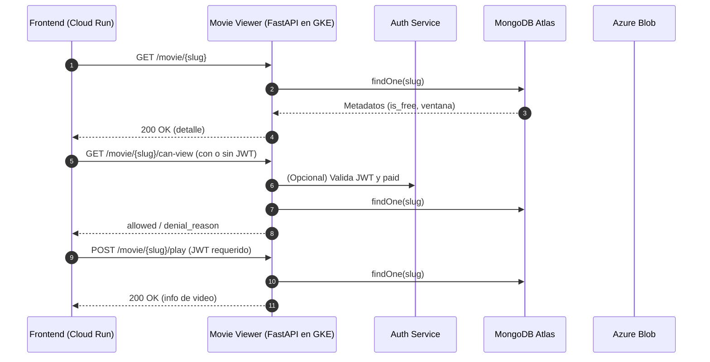
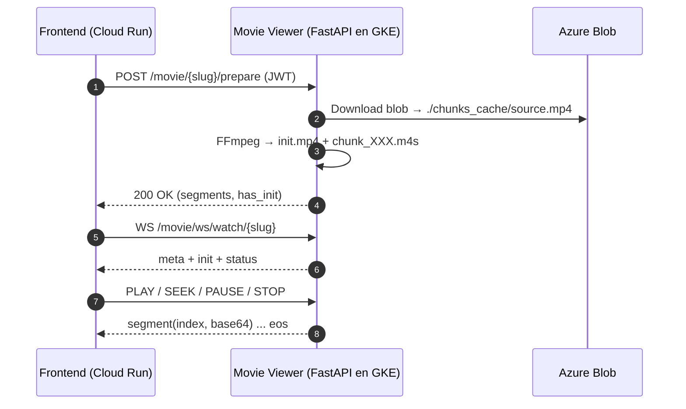

# Microservicio de Ver Películas

Servicio responsable de **detalle, validación de acceso y reproducción** de películas en Chapinflix. Construido con **FastAPI** y preparado para ejecutarse en un **cluster de Kubernetes en GCP**. Integra autenticación por **JWT**, reglas de disponibilidad, control de acceso por suscripción y un **pipeline de streaming** basado en fragmentación HLS (fMP4) a partir de archivos alojados en **Azure Blob Storage**.

En el ecosistema, el frontend corre en **Google Cloud Run**, el catálogo de contenido reside en **MongoDB Atlas** y el estado de pago se sincroniza desde el microservicio de pagos (Stripe) hacia **Cloud SQL**. Este servicio usa MongoDB para leer metadatos de las películas y Azure Blob para la entrega del video.

---

## Objetivos

* Exponer endpoints públicos para **detalle de película** y **evaluación de acceso** según ventana de disponibilidad y estado de suscripción.
* Entregar un flujo de **reproducción** que, tras validar acceso, permita generar **segmentos HLS fMP4** listos para el cliente.
* Ofrecer un **protocolo WebSocket** simple para servir init y segmentos, con soporte de pausa, búsqueda y fin de transmisión.

---

## Arquitectura Lógica

* **FastAPI + CORS** para consumo desde Cloud Run.
* **Middleware JWT** (cookie o header) que inyecta el contexto del usuario (pagado/no pagado) en la request.
* **MongoDB Atlas** como almacén de películas (metadatos, disponibilidad, blob\_path/URL).
* **Azure Blob Storage** como origen del MP4: descarga server-side y fragmentación con **FFmpeg**.
* **HLS (fMP4)** con segmentos cortos y archivo init para inicializar el buffer del reproductor.

---

## Componentes Principales

* **Aplicación (`main.py`)**: inicializa FastAPI, CORS, middleware de autenticación, ciclo de vida de MongoDB y monta el router de reproducción.
* **Autenticación (`authkit.py`)**: decodifica JWT (HS256), construye un contexto con campos como `paid` para decisiones de acceso.
* **Mongo (`db_mongo.py`)**: inicialización del cliente e inyección de la DB en requests.
* **Azure Blob (`azure_movies_blob.py`)**: utilidades para construir la URL base, generar **SAS de lectura** temporal y descargar el MP4 a disco.
* **Utilidades (`utils.py`)**: reloj UTC, validación de **ventana de disponibilidad** (`available_from`/`available_until`) y conversión segura a JSON (ObjectId → str).
* **Streaming utils (`utils_stream.py`)**: carpeta de trabajo `./chunks_cache`, parámetros `SEG_DUR` y `CODECS`, y tarea FFmpeg que genera `init.mp4` + `chunk_XXX.m4s`.
* **Router (`routers/movie_viewer.py`)**: endpoints `/{slug}`, `/{slug}/can-view`, `/{slug}/play`, `/{slug}/prepare` y **WebSocket** `/ws/watch/{slug}` con protocolo de envío de segmentos en base64.
* **Modelos (`models/schemas.py`)**: contratos de `MovieDetail`, `CanViewResponse` y `PlayResult`.

---

## Reglas de Disponibilidad y Acceso

* **Disponibilidad**: se evalúan `available_from` y `available_until` en UTC; si fuera de ventana, se deniega.
* **Pago**: si `is_free=false` y el usuario no está pagado (`paid=false`), se deniega con motivo `payment_required`.

---

## Endpoints

* `GET /movie/{slug}` → **Detalle**: devuelve metadatos, categorías, imágenes y marcas de tiempo de disponibilidad; incluye opcionalmente referencias al video (ruta del blob o URL pública si el contenedor fuera público).
* `GET /movie/{slug}/can-view` → **Evaluación**: responde `allowed=true/false` y `denial_reason` (`not_yet_available`, `expired`, `payment_required`).
* `POST /movie/{slug}/play` → **Autorización de reproducción**: requiere JWT; si procede, devuelve título, slug e información de video (para el flujo siguiente).
* `POST /movie/{slug}/prepare` → **Preparación de segmentos**: descarga el MP4 desde Azure a `./chunks_cache/source.mp4` y ejecuta FFmpeg para producir `init.mp4` y `chunk_XXX.m4s`.
* `WS /movie/ws/watch/{slug}` → **Streaming**: tras un `prepare` exitoso, sirve init y segmentos vía WebSocket con mensajes en JSON base64.

### Protocolo WebSocket (resumen)

Mensajes **servidor→cliente**:

* `meta`: `{ segDuration, codecs, chunkFirst, chunkLast }`
* `init`: `{ base64 }`
* `segment`: `{ index, base64 }`
* `status|warn|error|eos`: estados, advertencias, errores, fin de transmisión

Comandos **cliente→servidor**:

* `PLAY`, `PAUSE`, `SEEK { timeSec }`, `START { startTimeSec }`, `STOP`

> Nota: La carpeta `./chunks_cache` es **única y compartida**. El flujo está pensado para una sesión a la vez por instancia. En producción se recomienda usar carpetas por sesión o externalizar la entrega HLS (CDN/Blob con SAS) para concurrencia y escalabilidad.

---

## Variables de Entorno

* `MONGO_URI`, `MONGO_DB`
* `AUTH_SECRET_KEY` (HS256)
* `CONNECTION_STRING`, `AZURE_MOVIES_CONTAINER`
* (Contenedor) Debe incluir **FFmpeg** en la imagen para la tarea de fragmentación.

---

## Despliegue en GCP

* **Imagen**: Docker con FFmpeg incluido.
* **GKE**: `Deployment` y `Service` detrás de **Ingress** (TLS). Asignar volumen efímero para `./chunks_cache` o almacenamiento temporal.
* **Secrets**: credenciales de Mongo y Azure, `AUTH_SECRET_KEY`.
* **Escalado**: limitar afinidad/concurrencia si se mantiene carpeta compartida; preferir diseño por sesión para horizontalidad.

---

## Consideraciones de Seguridad

* Validación de JWT estricta en `/play`, `/prepare` y WebSocket (si se añade autenticación al WS).
* SAS de lectura con **expiración corta** para accesos temporales si se expone URL directa.
* Sanitización de `slug` y verificación de existencia del video (`video_blob_path`).

---

## Secuencias de Interacción

### A) Verificación y reproducción

### B) Preparación y streaming WebSocket

