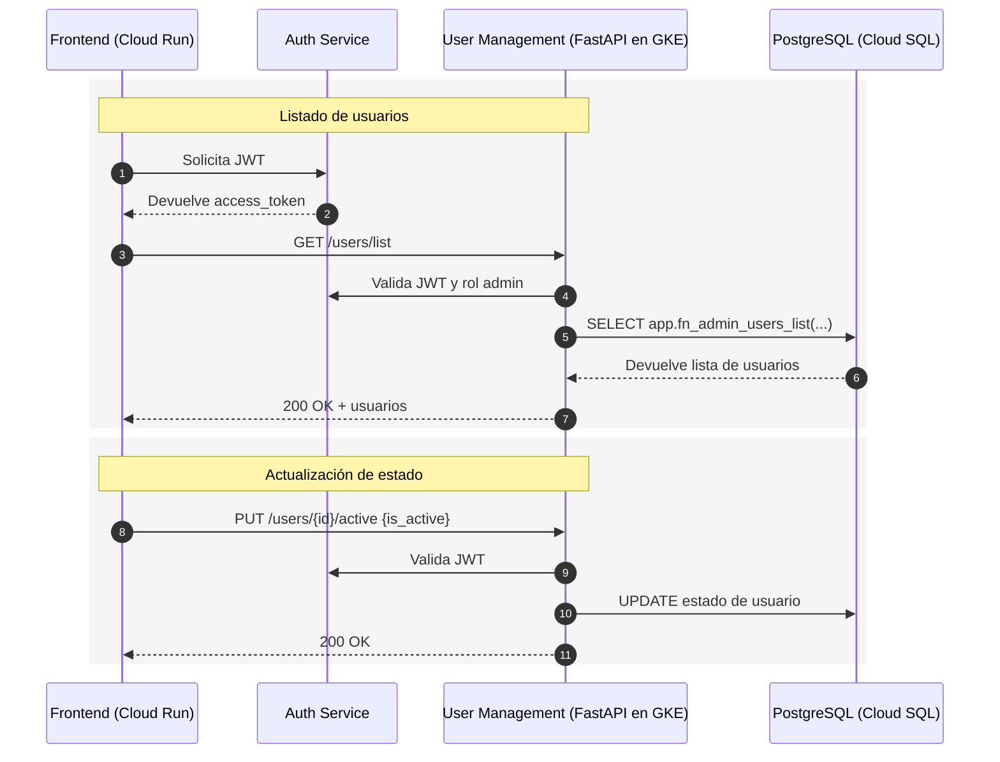

# Microservicio de Gestión de Usuarios

Este microservicio se encarga de la **administración completa de usuarios** dentro de la plataforma Chapinflix. Está desarrollado en **FastAPI** y desplegado en un **cluster de Kubernetes en Google Cloud Platform (GCP)**. Su objetivo principal es proporcionar a los administradores un conjunto de endpoints seguros para consultar, gestionar y modificar el estado y los permisos de las cuentas de usuario.

En el ecosistema global, este servicio se comunica con:

* **Microservicio de Autenticación** para validar tokens JWT y roles.
* **PostgreSQL (Cloud SQL)** como base de datos principal para el almacenamiento y consultas.
* **Google Cloud Run** para el frontend que consume la API.
* **Otros servicios internos** que dependen del estado o roles de los usuarios.

---

## Objetivos

* Ofrecer un panel de control completo para la administración de usuarios por parte del equipo de operaciones o soporte.
* Permitir búsquedas avanzadas, filtrado, ordenamiento y paginación de usuarios.
* Consultar estadísticas globales sobre la base de usuarios.
* Actualizar roles, estados y permisos de las cuentas.
* Integrarse con otros servicios del ecosistema mediante **JWT** y control de acceso basado en roles.

---

## Arquitectura Lógica

* **FastAPI** para la API REST.
* **PostgreSQL (Cloud SQL)** como almacenamiento relacional principal.
* **JWT** para autenticación y autorización basada en roles.
* **AsyncIO + asyncpg** para operaciones de base de datos de alto rendimiento.
* **CORS** habilitado para permitir solicitudes desde el frontend en **Cloud Run**.

---

## Componentes Principales

* **`authkit.py`** – Middleware de autenticación basado en JWT, utilizado para validar el contexto del usuario y restringir el acceso a endpoints solo para administradores. 【63†authkit.py†L1-L80】
* **`db.py`** – Inicialización de conexión con **PostgreSQL** mediante `asyncpg`, con configuración de pool y esquema `app`. 【64†db.py†L1-L40】
* **`main.py`** – Configuración e inicialización del servicio, CORS, middleware, health check y registro de routers. 【65†main.py†L1-L40】
* **`users.py`** – Núcleo funcional de la API con operaciones CRUD sobre usuarios, incluyendo listados, contadores, detalles y actualización de estados o roles. 【66†users.py†L1-L160】
* **`schemas.py`** – Modelos Pydantic para validación de peticiones y respuestas, filtros de búsqueda, estructuras de detalle y estadísticas. 【67†schemas.py†L1-L100】

---

## Flujos Clave

### Listado y Búsqueda de Usuarios

1. El cliente realiza un `GET /users/list` con filtros opcionales (por email, username, fechas, estado, roles, etc.).
2. El servicio valida el JWT y el rol de administrador.
3. Ejecuta la función `app.fn_admin_users_list` en PostgreSQL para obtener resultados paginados.
4. Devuelve un objeto con el total de usuarios y una lista de usuarios filtrados.

### Contadores Globales

* El endpoint `GET /users/counters` devuelve métricas agregadas: usuarios activos, verificados, pagos, con 2FA habilitado, bloqueados, etc.

### Detalle de Usuario

* `GET /users/{user_id}/detail` devuelve información completa de un usuario, incluyendo estadísticas de tokens de acceso y verificación.

### Modificación de Estados y Roles

* Permite modificar el estado de un usuario (`active`, `verified`, `paid`) y asignar o revocar roles (`admin`, `content_handler`) mediante endpoints `PUT`.
* Incluye salvaguardas, como la imposibilidad de eliminar el rol de administrador del último admin.

---

## Endpoints Principales (Resumen)

* `GET /users/list` – Listado con filtros y paginación.
* `GET /users/counters` – Estadísticas globales de usuarios.
* `GET /users/{user_id}/detail` – Detalle completo de un usuario.
* `PUT /users/{user_id}/active` – Activar o desactivar usuario.
* `PUT /users/{user_id}/verified` – Marcar usuario como verificado o no.
* `PUT /users/{user_id}/paid` – Cambiar estado de suscripción.
* `PUT /users/{user_id}/admin` – Asignar o revocar rol de administrador.
* `PUT /users/{user_id}/content-handler` – Asignar o revocar rol de gestor de contenido.

---

## Variables de Entorno (.env)

* `DATABASE_URL` – Cadena de conexión a PostgreSQL.
* `AUTH_SECRET_KEY` – Clave compartida para validación de JWT.
* `AUTH_ALGORITHM` – Algoritmo JWT (por defecto `HS256`).

---

## Despliegue en GCP

* **Contenedor**: Construir imagen Docker y desplegar en **GKE**.
* **Cloud SQL**: Configurar la conexión segura con credenciales en `Secrets`.
* **Frontend (Cloud Run)**: Consumir la API para paneles de administración.
* **Monitoring**: Integración con Cloud Monitoring y Logging.

---

## Consideraciones de Seguridad

* Todos los endpoints requieren autenticación JWT y rol `admin`.
* Control de acceso granular a funciones críticas.
* Manejo de errores de base de datos y validación de entradas.
* Restricción para evitar eliminar el último administrador.
* Sanitización de consultas para prevenir inyección SQL.

---

## Secuencia de Interacción (Alto Nivel)

---

## Desarrollo Local

1. Configurar `.env` con las credenciales necesarias (DB, JWT, etc.).
2. Ejecutar migraciones y crear funciones necesarias en PostgreSQL.
3. Iniciar el servicio: `uvicorn main:app --reload`.
4. Probar endpoints desde Postman o el panel frontend.

---

## Salud y Observabilidad

* **Health Check**: `GET /health`.
* **Logs**: Registro de consultas, modificaciones y errores.
* **Métricas**: Seguimiento de usuarios activos, bloqueados y estadísticas de crecimiento.

---

## Licencia

Este proyecto se distribuye bajo la licencia establecida por el propietario del sistema.
