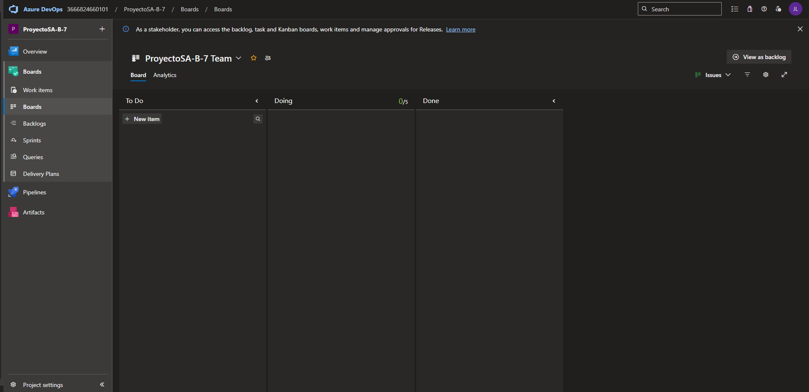
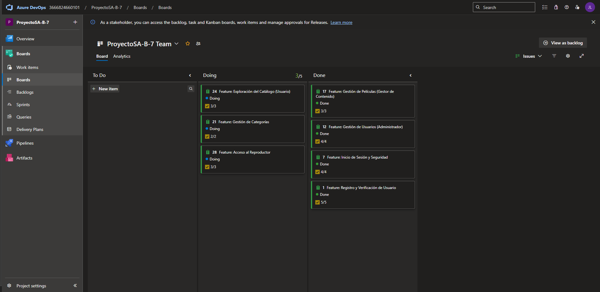
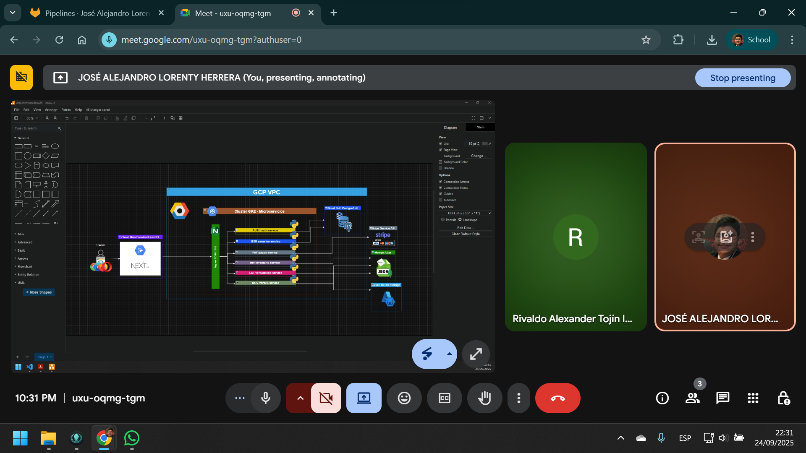
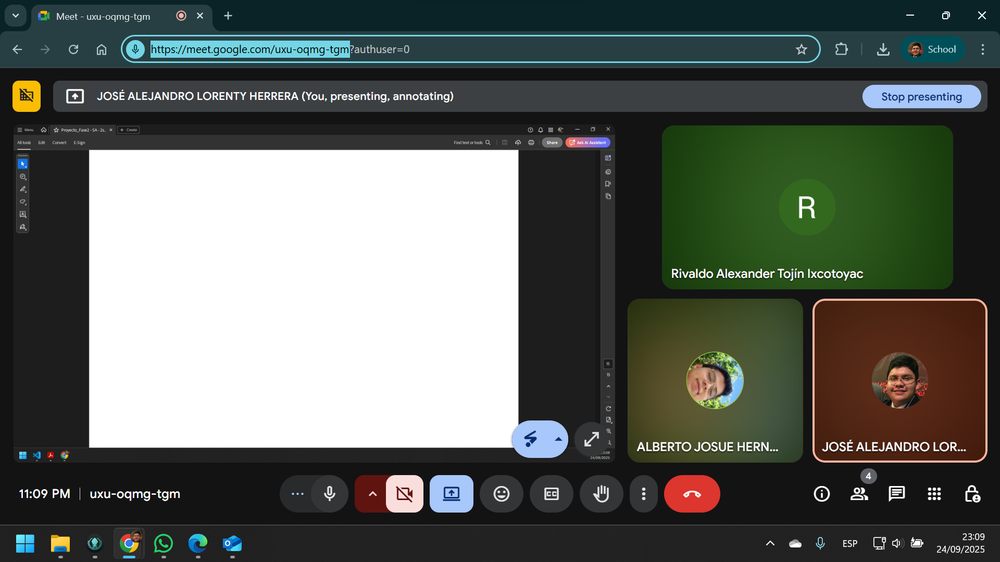
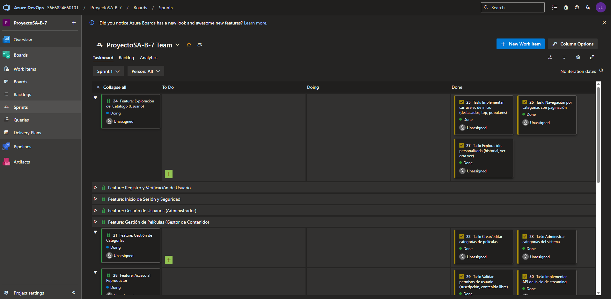

# Metodología Ágil Utilizada

El proyecto se desarrolló aplicando **Scrum**, adaptado al tiempo disponible definido en el cronograma oficial del curso.  
Dado que el período de elaboración es de **20 días (05/09/2025 – 24/09/2025)**, se trabajó en un **único sprint** que concentró todas las actividades necesarias para entregar el sistema funcional.

### Planificación
- Se definió un **Product Backlog** con todas las funcionalidades clave.
- El backlog se desglosó en tareas manejables y priorizadas de acuerdo con los casos de uso críticos.
- El alcance del sprint fue entregar una versión funcional del sistema con las funcionalidades mínimas.

  

  

### Sprint
- **Sprint Único:** del **12/08/2025 al 27/08/2025**.
- Incluyó desarrollo backend y frontend, integración de microservicios, pruebas y documentación.
- Al final se consolidó la presentación y entrega para calificación.

  

  

### Retroalimentación
- Del **28/08/2025 al 30/08/2025** se destinó a **calificación y retroalimentación final** por parte del auxiliar

### Seguimiento
- Se utilizó un **tablero Kanban** con las columnas:  
  **To do → Doing → Done**.
- Este tablero permitió visualizar el flujo de trabajo y detectar bloqueos.

---

## 4. Cronograma

| Tipo                  | Fecha Inicio | Fecha Fin   |
|-----------------------|--------------|-------------|
| Asignación de Proyecto| 05/09/2025   | 24/08/2025  |
| Elaboración           | 05/09/2025   | 24/08/2025  |
| Calificación          | 25/09/2025   | 27/08/2025  |

  

---
