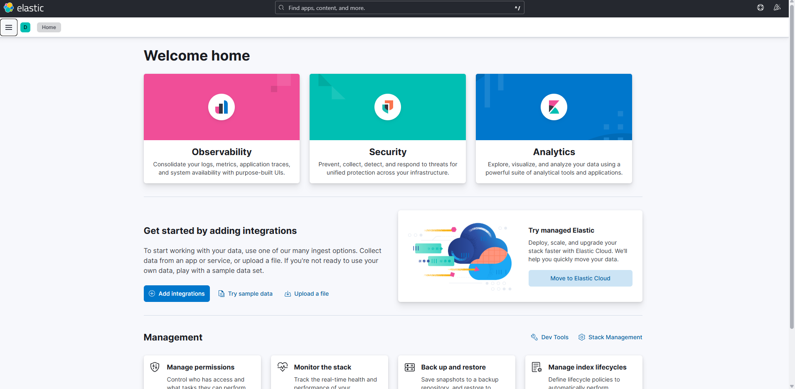
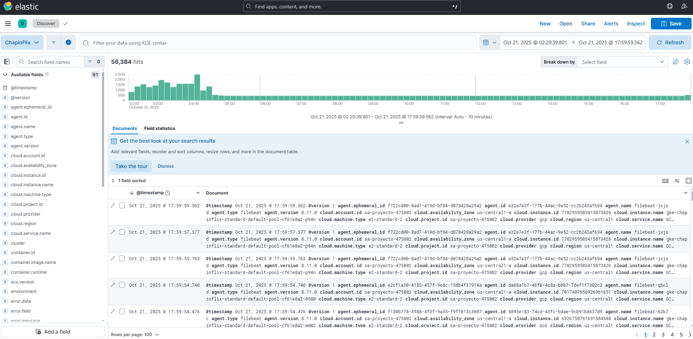
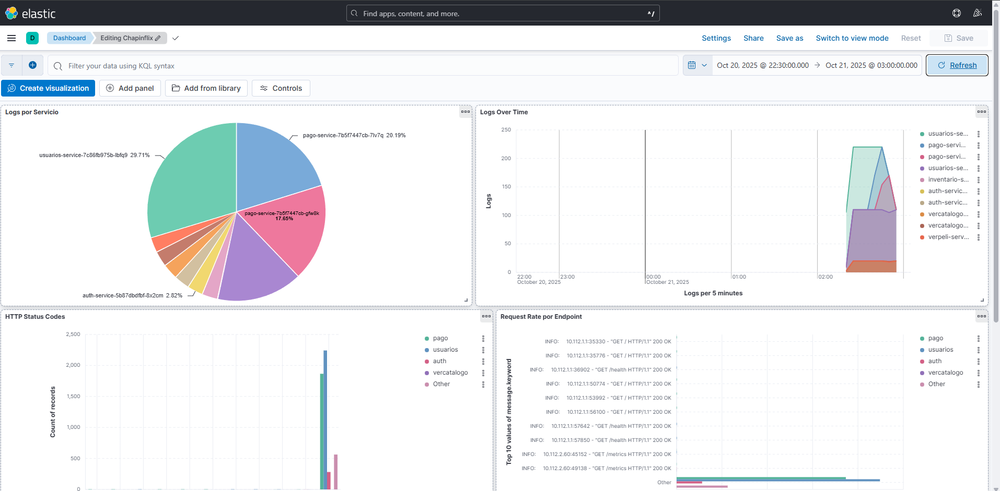

# Guía de Usuario
## Stack de Logging: Elasticsearch + Logstash + Kibana
---

## Tabla de Contenidos

1. [Introducción](#introducción)
2. [Acceso a Kibana](#acceso-a-kibana)
3. [Interfaz de Kibana](#interfaz-de-kibana)
4. [Discover: Exploración de Logs](#discover-exploración-de-logs)
5. [Búsquedas con KQL](#búsquedas-con-kql)
6. [Filtros y Agregaciones](#filtros-y-agregaciones)
7. [Visualizaciones y Dashboards](#visualizaciones-y-dashboards)
8. [Casos de Uso Comunes](#casos-de-uso-comunes)
9. [Mejores Prácticas](#mejores-prácticas)

---

## Introducción

Esta guía explica cómo utilizar el stack de logging de Chapinflix para buscar, analizar y visualizar logs de los microservicios.

### Herramientas Disponibles

- **Kibana**: Interfaz web principal para búsqueda y visualización de logs
- **Elasticsearch**: Motor de búsqueda (acceso directo no recomendado para usuarios)
- **Logstash**: Procesador de logs (funcionamiento automático)
- **Filebeat**: Recolector de logs (funcionamiento automático)

### Usuarios Objetivo

- Desarrolladores que necesitan debuggear problemas
- Administradores de sistemas que monitorean el comportamiento de servicios
- DevOps que analizan tendencias y patrones en logs

---

## Acceso a Kibana

### Obtener URL de Acceso

```bash
# Obtener IP externa de Kibana
kubectl get svc kibana -n logging -o jsonpath='{.status.loadBalancer.ingress[0].ip}'
```



### Acceder a Kibana

- URL: `http://<KIBANA_IP>:5601`
- No requiere autenticación (seguridad deshabilitada para desarrollo)

**Tiempo de carga inicial:** Kibana puede tardar 30-60 segundos en cargar completamente la primera vez.

---

## Interfaz de Kibana

### Página Principal

Al acceder a Kibana, verá el **Home** con opciones para:
- **Add data**: Agregar fuentes de datos
- **Explore**: Explorar datos existentes
- **Manage**: Gestionar configuración

### Menú Principal (≡)

El menú hamburguesa en la esquina superior izquierda proporciona acceso a:

**Analytics:**
- **Discover**: Búsqueda y exploración de logs
- **Dashboard**: Dashboards y visualizaciones
- **Visualize Library**: Crear y gestionar visualizaciones

**Observability:**
- **Logs**: Vista especializada de logs (alternativa a Discover)
- **APM**: Application Performance Monitoring
- **Uptime**: Monitoreo de uptime

**Management:**
- **Stack Management**: Configuración general
  - **Data Views**: Gestión de index patterns
  - **Advanced Settings**: Configuraciones avanzadas

### Barra de Navegación Superior

- **Búsqueda global**: Buscar en todos los espacios
- **Selector de tiempo**: Ajustar rango temporal
- **Notificaciones**: Alertas y mensajes del sistema
- **Usuario/Configuración**: Ajustes de usuario

---

## Discover: Exploración de Logs

### Acceder a Discover

1. Click en el menú (≡) → **Analytics** → **Discover**
2. Si es la primera vez, debe crear un Data View (ver Manual de Instalación)
3. Seleccionar el data view "Chapinflix Logs"

### Componentes de Discover

#### 1. Barra de Búsqueda (KQL)
En la parte superior, permite escribir consultas en Kibana Query Language.

Ejemplo:
```
log_level: "ERROR"
```

#### 2. Selector de Tiempo
En la esquina superior derecha:
- **Quick**: Opciones rápidas (Last 15 minutes, Last 1 hour, Last 24 hours, etc.)
- **Relative**: Tiempo relativo (ej: Last 2 days)
- **Absolute**: Fechas específicas
- **Refresh**: Actualización automática (Off, 5s, 10s, 30s, 1m, etc.)

#### 3. Histograma de Tiempo
Gráfico de barras que muestra la distribución temporal de logs.
- Click en una barra para filtrar por ese período
- Zoom con click y arrastrar

#### 4. Campos Disponibles (Sidebar Izquierdo)
Lista de todos los campos en los logs:
- **Populares** (⭐): Campos más usados
- **Available fields**: Todos los campos disponibles

**Acciones en campos:**
- **Hover**: Ver estadísticas rápidas
- **+**: Agregar columna a la tabla
- **i**: Ver detalles y top values del campo

#### 5. Tabla de Documentos
Muestra los logs que coinciden con la búsqueda:
- **Expansión**: Click en **>** para ver todos los campos del log
- **Contexto**: Ver logs antes y después
- **Filtrar**: Agregar filtros rápidos desde los valores




### Campos Comunes en Logs de Chapinflix

| Campo | Descripción | Ejemplo |
|-------|-------------|---------|
| `@timestamp` | Fecha y hora del log | 2025-10-21T14:30:45.123Z |
| `message` | Mensaje del log | "User authentication failed" |
| `log_level` | Nivel del log | ERROR, WARN, INFO, DEBUG |
| `k8s_namespace` | Namespace de Kubernetes | default |
| `k8s_pod` | Nombre del pod | auth-service-abc123 |
| `k8s_container` | Nombre del contenedor | auth-service |
| `kubernetes.pod.name` | Nombre completo del pod | auth-service-7d8f9c-abc123 |
| `kubernetes.namespace` | Namespace | default |
| `host.name` | Nodo del cluster | gke-chapinflix-xyz |
| `agent.hostname` | Host de Filebeat | gke-chapinflix-xyz |

### Visualizar un Log Individual

1. En la tabla de documentos, click en **>** junto a un log
2. Se expandirá mostrando:
   - **Table**: Vista de tabla con campo y valor
   - **JSON**: Vista JSON completa
3. Acciones disponibles:
   - **View surrounding documents**: Ver logs antes y después
   - **View single document**: Ver solo este documento
   - **Filter for value (+)**: Filtrar logs con este valor
   - **Filter out value (-)**: Excluir logs con este valor

### Personalizar Columnas

Por defecto, solo se muestra el campo `@timestamp` y `message`.

**Agregar columnas:**
1. En el sidebar izquierdo, buscar el campo deseado
2. Hover sobre el campo
3. Click en el botón **+**

**Quitar columnas:**
1. En el header de la tabla, hover sobre el nombre de la columna
2. Click en el botón **x**

**Columnas recomendadas:**
- `@timestamp`
- `log_level`
- `k8s_pod`
- `message`

### Guardar Búsqueda

Una vez configurada una búsqueda útil:

1. Click en **Save** en la parte superior
2. Ingresar nombre descriptivo: ej. "Auth Service Errors"
3. (Opcional) Guardar rango de tiempo
4. Click en **Save**

**Abrir búsqueda guardada:**
1. Click en **Open** en la parte superior
2. Seleccionar la búsqueda guardada
3. Click en abrir

---



## Búsquedas con KQL

### Kibana Query Language (KQL)

KQL es el lenguaje de consulta principal de Kibana.

### Sintaxis Básica

#### Buscar en Todos los Campos
```
error
```
Busca "error" en cualquier campo.

#### Buscar en un Campo Específico
```
log_level: "ERROR"
```

#### Operadores Lógicos

**AND:**
```
log_level: "ERROR" AND k8s_pod: "auth-service*"
```

**OR:**
```
log_level: "ERROR" OR log_level: "WARN"
```

**NOT:**
```
NOT log_level: "DEBUG"
```

#### Wildcards

**Asterisco (*) - Múltiples caracteres:**
```
k8s_pod: "auth-*"
```
Coincide con: auth-service, auth-service-abc123, etc.

**Interrogación (?) - Un carácter:**
```
k8s_pod: "auth-service-?bc123"
```

### Búsquedas por Rango

#### Rangos de Números
```
status >= 500 AND status < 600
```

#### Rangos de Fechas
```
@timestamp >= "2025-10-21T00:00:00" AND @timestamp <= "2025-10-21T23:59:59"
```
Nota: Es más fácil usar el selector de tiempo visual.

### Búsquedas en Campos de Texto

#### Frase Exacta
```
message: "connection timeout"
```

#### Contiene Palabra
```
message: *timeout*
```

#### Expresión Regular (Requiere Lucene)
Para regex, cambiar a Lucene query syntax:
```
message: /user_[0-9]+/
```

### Verificar Existencia de Campo

#### Campo Existe
```
k8s_pod: *
```

#### Campo No Existe
```
NOT k8s_pod: *
```

### Ejemplos de Consultas Comunes

#### Todos los errores
```
log_level: "ERROR"
```

#### Errores del servicio de autenticación
```
log_level: "ERROR" AND k8s_pod: "auth-service*"
```

#### Logs que contienen "failed" o "error" en el mensaje
```
message: (*failed* OR *error*)
```

#### Logs de últimos 5 minutos excluyendo DEBUG
```
NOT log_level: "DEBUG"
```
(Y ajustar selector de tiempo a "Last 5 minutes")

#### Logs de un pod específico
```
kubernetes.pod.name: "auth-service-7d8f9c-abc123"
```

#### Múltiples servicios
```
k8s_pod: ("auth-service*" OR "pago-service*")
```

---

## Filtros y Agregaciones

### Agregar Filtros

Los filtros son una alternativa visual a las consultas KQL.

#### Método 1: Desde un Valor

1. Expandir un log
2. Hover sobre un valor
3. Click en el icono **+** (filtrar por este valor)
4. O click en el icono **-** (excluir este valor)

#### Método 2: Manualmente

1. Click en **Add filter** debajo de la barra de búsqueda
2. Configurar:
   - **Field**: Seleccionar campo (ej: log_level)
   - **Operator**: is, is not, is one of, exists, etc.
   - **Value**: Valor a filtrar (ej: ERROR)
3. Click en **Save**

### Gestión de Filtros

**Editar filtro:**
- Hover sobre el filtro
- Click en el icono de lápiz

**Deshabilitar filtro:**
- Click en el filtro (se pondrá en gris)
- Click nuevamente para rehabilitar

**Eliminar filtro:**
- Hover sobre el filtro
- Click en el icono de X

**Pin filter:**
- Click en el icono de pin para mantener el filtro activo al cambiar de vista

### Agregaciones en Discover

#### Ver Top Values de un Campo

1. En el sidebar izquierdo, buscar un campo
2. Hover sobre el campo
3. Click en el campo
4. Ver "Top 5 values" en el popup
5. Click en **Visualize** para crear una visualización

#### Ejemplo: Top Servicios Generando Logs

1. Click en el campo `k8s_pod`
2. Ver los 5 pods con más logs
3. Click en cualquier valor para filtrar

---

## Visualizaciones y Dashboards

### Crear Visualización desde Discover

1. Tener una búsqueda configurada en Discover
2. Click en un campo en el sidebar
3. Click en **Visualize** en el popup
4. Se abrirá **Lens** (editor de visualizaciones)
5. Configurar la visualización
6. **Save**

### Editor Lens

Lens es el editor visual de Kibana para crear visualizaciones.

#### Tipos de Visualizaciones

- **Bar vertical/horizontal**: Gráficos de barras
- **Line**: Gráficos de líneas (series temporales)
- **Area**: Gráficos de área
- **Pie/Donut**: Gráficos circulares
- **Metric**: Números grandes (KPIs)
- **Table**: Tablas
- **Heatmap**: Mapas de calor

#### Crear Visualización Manualmente

1. Ir a menú (≡) → **Analytics** → **Visualize Library**
2. Click en **Create visualization**
3. Seleccionar tipo o usar **Lens**
4. Seleccionar data view "Chapinflix Logs"
5. Arrastrar campos a las áreas de configuración:
   - **Vertical axis** (Y-axis): Métrica (Count, Sum, etc.)
   - **Horizontal axis** (X-axis): Dimensión (@timestamp, campos categóricos)
   - **Break down by**: Agrupar por campo
6. **Save and return**

### Crear Dashboard

1. Ir a menú (≡) → **Analytics** → **Dashboard**
2. Click en **Create dashboard**
3. Click en **Add panel**
4. Seleccionar visualización existente o crear nueva
5. Ajustar tamaño y posición de los paneles
6. Click en **Save**

### Ejemplo de Dashboard: "Chapinflix Logs Overview"

**Paneles sugeridos:**

1. **Total Logs (Last 24h)** - Metric
   - Métrica: Count of logs
   - Filtro de tiempo: Last 24 hours

2. **Logs by Level** - Pie Chart
   - Métrica: Count
   - Breakdown by: log_level.keyword

3. **Logs Timeline** - Line Chart
   - Y-axis: Count
   - X-axis: @timestamp (histogram)
   - Breakdown by: log_level.keyword

4. **Top Services** - Bar Horizontal
   - Y-axis: Count
   - X-axis: k8s_pod.keyword (top 10)

5. **Error Logs Table** - Table
   - Columns: @timestamp, k8s_pod, message
   - Filter: log_level = ERROR
   - Rows: 10

6. **Logs by Container** - Donut
   - Métrica: Count
   - Breakdown by: k8s_container.keyword

---

## Casos de Uso Comunes

### Caso 1: Debugging de Errores en Producción

**Escenario:** Los usuarios reportan errores en el servicio de autenticación.

**Pasos:**

1. **Ir a Discover**

2. **Buscar errores del servicio:**
   ```
   log_level: "ERROR" AND k8s_pod: "auth-service*"
   ```

3. **Ajustar tiempo:** Last 1 hour

4. **Agregar columnas útiles:**
   - `@timestamp`
   - `log_level`
   - `k8s_pod`
   - `message`

5. **Analizar patrones:**
   - ¿Hay un error específico que se repite?
   - ¿El error empezó en un momento específico?
   - ¿Afecta a un pod específico o a todos?

6. **Ver contexto de un error:**
   - Expandir un log de error
   - Click en **View surrounding documents**
   - Ver logs antes y después para entender el contexto

7. **Exportar resultados:**
   - Click en **Share** → **CSV Reports**
   - O tomar screenshots para el ticket

### Caso 2: Monitorear Despliegue

**Escenario:** Se acaba de desplegar una nueva versión del servicio de pagos.

**Pasos:**

1. **Crear búsqueda específica:**
   ```
   k8s_pod: "pago-service*"
   ```

2. **Ajustar tiempo:** Last 15 minutes (con auto-refresh cada 10s)

3. **Monitorear logs en tiempo real:**
   - Buscar errores: agregar filtro `log_level: ERROR`
   - Buscar warnings: agregar filtro `log_level: WARN`

4. **Crear visualización rápida:**
   - Click en campo `log_level`
   - Click en **Visualize**
   - Ver distribución de niveles de log

5. **Si hay problemas:**
   - Filtrar por `log_level: ERROR`
   - Identificar el error
   - Documentar para rollback

### Caso 3: Análisis de Rendimiento

**Escenario:** Analizar tiempos de respuesta del servicio de video.

**Pasos:**

1. **Buscar logs de procesamiento:**
   ```
   k8s_pod: "verpeli-service*" AND message: *processing*
   ```

2. **Buscar logs lentos:**
   ```
   k8s_pod: "verpeli-service*" AND message: (*slow* OR *timeout* OR *exceeded*)
   ```

3. **Crear visualización de timeline:**
   - Ver cuando ocurren más logs lentos
   - Correlacionar con horarios de alta carga

4. **Agregar filtros para análisis:**
   - Filtrar por hora del día
   - Filtrar por tipo de operación

### Caso 4: Investigar Comportamiento Anómalo

**Escenario:** Se detectó un pico de tráfico inusual.

**Pasos:**

1. **Ver todos los servicios:**
   ```
   k8s_namespace: "default"
   ```

2. **Ajustar tiempo al período del pico:**
   - Usar selector de tiempo absolute
   - Seleccionar rango específico

3. **Analizar distribución por servicio:**
   - Visualizar campo `k8s_pod`
   - Identificar qué servicio tuvo más actividad

4. **Buscar patrones:**
   ```
   message: (*unusual* OR *suspicious* OR *blocked*)
   ```

5. **Analizar IPs (si están en logs):**
   - Buscar campo de IP de origen
   - Ver top IPs generando tráfico

### Caso 5: Audit Trail de Operaciones

**Escenario:** Rastrear quién hizo qué cambio en el sistema.

**Pasos:**

1. **Buscar logs de operaciones:**
   ```
   message: (*created* OR *updated* OR *deleted*)
   ```

2. **Filtrar por servicio específico:**
   ```
   k8s_pod: "usuarios-service*" AND message: (*created* OR *updated* OR *deleted*)
   ```

3. **Buscar operaciones de un usuario:**
   Si los logs incluyen user_id:
   ```
   user_id: "12345"
   ```

4. **Crear tabla de audit:**
   - Columnas: @timestamp, user_id, action, resource
   - Ordenar por timestamp descendente

---

## Mejores Prácticas

### Búsqueda y Exploración

1. **Empezar amplio, luego refinar:**
   - Comenzar con una búsqueda simple
   - Ir agregando filtros progresivamente

2. **Usar el selector de tiempo adecuado:**
   - Para debugging reciente: Last 15 minutes
   - Para análisis de tendencias: Last 7 days
   - Para incidentes específicos: Absolute time range

3. **Aprovechar los filtros visuales:**
   - Más intuitivos que escribir KQL
   - Fáciles de habilitar/deshabilitar

4. **Guardar búsquedas frecuentes:**
   - Crear biblioteca de búsquedas comunes
   - Compartir con el equipo

### Rendimiento

1. **Limitar el rango de tiempo:**
   - Consultas sobre mucho tiempo son lentas
   - Usar el rango más pequeño posible

2. **Usar filtros en lugar de búsqueda de texto:**
   - Filtros en campos keyword son más rápidos
   - Evitar wildcards innecesarios

3. **Limitar número de documentos:**
   - Por defecto muestra 500 documentos
   - Aumentar solo si es necesario

### Visualizaciones

1. **Nombrar descriptivamente:**
   - Nombres claros: "Errors by Service (Last 24h)"
   - No usar nombres genéricos: "Visualization 1"

2. **Usar colores consistentes:**
   - ERROR: Rojo
   - WARN: Amarillo/Naranja
   - INFO: Azul
   - DEBUG: Gris

3. **Mantener dashboards simples:**
   - Máximo 8-10 paneles por dashboard
   - Si necesitas más, crear múltiples dashboards

### Mantenimiento

1. **Revisar índices regularmente:**
   ```bash
   kubectl exec -n logging -it statefulset/elasticsearch -- curl -s http://localhost:9200/_cat/indices?v
   ```

2. **Eliminar índices antiguos:**
   - Elasticsearch puede llenar el disco
   - Configurar retención (ej: 7 días)
   ```bash
   # Ejemplo: eliminar índices mayores a 7 días
   kubectl exec -n logging -it statefulset/elasticsearch -- curl -XDELETE http://localhost:9200/chapinflix-logs-2025.10.14
   ```

3. **Monitorear health de Elasticsearch:**
   ```bash
   kubectl exec -n logging -it statefulset/elasticsearch -- curl -s http://localhost:9200/_cluster/health | jq .
   ```

### Colaboración

1. **Compartir búsquedas guardadas:**
   - Documentar búsquedas útiles
   - Crear guía de búsquedas comunes

2. **Compartir dashboards:**
   - Export/Import de dashboards
   - Mantener dashboards actualizados

3. **Documentar hallazgos:**
   - Tomar screenshots de logs relevantes
   - Exportar datos para análisis offline

---

## Atajos de Teclado

| Acción | Atajo |
|--------|-------|
| Abrir menú principal | `Ctrl/Cmd + /` |
| Focus en búsqueda | `/` |
| Refrescar datos | `Ctrl/Cmd + R` |
| Abrir ayuda | `Shift + ?` |
| Navegar histórico | `Ctrl/Cmd + ←` / `→` |

---

## Comandos Útiles (CLI)

```bash
# Ver IP de Kibana
kubectl get svc kibana -n logging

# Ver logs de Kibana
kubectl logs -n logging -l app=kibana -f

# Port-forward para acceso local
kubectl port-forward -n logging svc/kibana 5601:5601
# Acceder a http://localhost:5601

# Ver índices en Elasticsearch
kubectl exec -n logging -it statefulset/elasticsearch -- curl -s http://localhost:9200/_cat/indices?v

# Contar documentos en índice
kubectl exec -n logging -it statefulset/elasticsearch -- curl -s "http://localhost:9200/chapinflix-logs-*/_count" | jq .

# Buscar directamente en Elasticsearch (ejemplo)
kubectl exec -n logging -it statefulset/elasticsearch -- curl -s -H "Content-Type: application/json" -XGET "http://localhost:9200/chapinflix-logs-*/_search" -d '{"query":{"match":{"log_level":"ERROR"}},"size":5}' | jq '.hits.hits[]._source'

# Eliminar índice específico
kubectl exec -n logging -it statefulset/elasticsearch -- curl -XDELETE http://localhost:9200/chapinflix-logs-2025.10.15
```