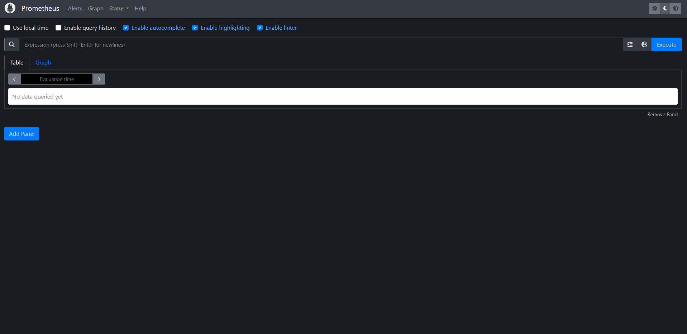
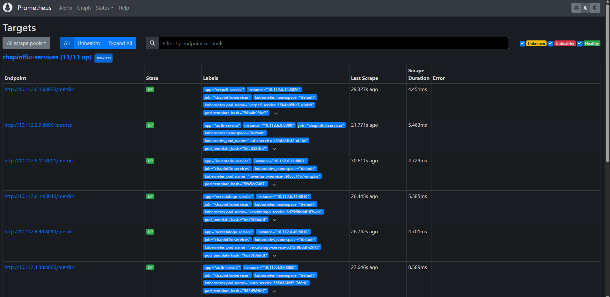
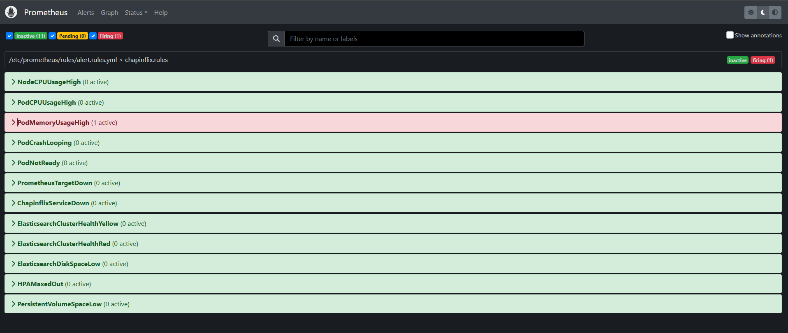
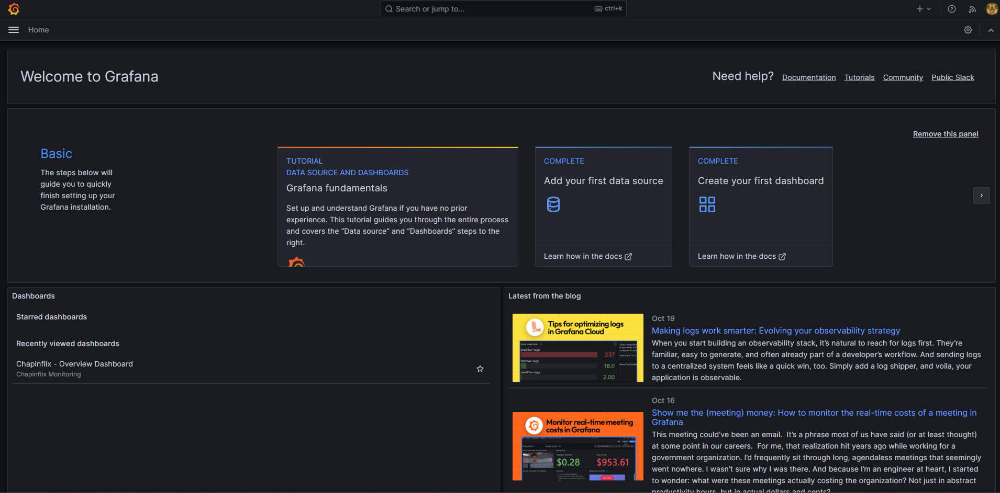
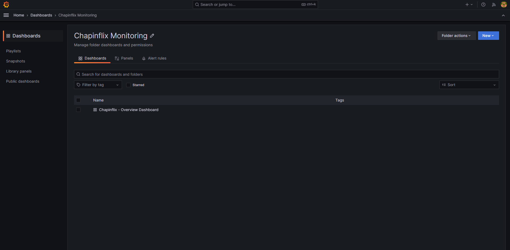
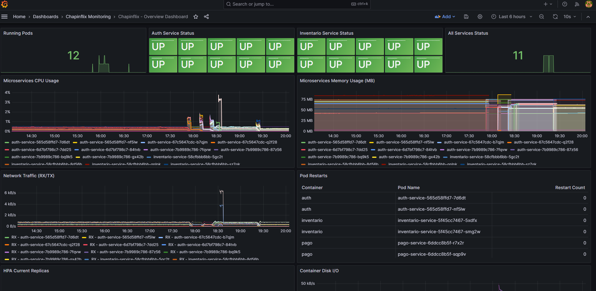

# Guía de Usuario
## Stack de Monitoring: Prometheus + Grafana

---

## Tabla de Contenidos

1. [Introducción](#introducción)
2. [Acceso a las Herramientas](#acceso-a-las-herramientas)
3. [Uso de Prometheus](#uso-de-prometheus)
4. [Uso de Grafana](#uso-de-grafana)
5. [Monitoreo de Microservicios](#monitoreo-de-microservicios)
6. [Gestión de Alertas](#gestión-de-alertas)
7. [Casos de Uso Comunes](#casos-de-uso-comunes)
8. [Mejores Prácticas](#mejores-prácticas)

---

## Introducción

Esta guía explica cómo utilizar las herramientas de monitoring de Chapinflix para supervisar el rendimiento del sistema, analizar métricas y gestionar alertas.

### Herramientas Disponibles

- **Prometheus**: Sistema de monitoreo y alertas para consultar métricas en tiempo real
- **Grafana**: Plataforma de visualización con dashboards interactivos

### Usuarios Objetivo

- Desarrolladores que necesitan monitorear el rendimiento de sus servicios
- Administradores de sistemas que supervisan la infraestructura
- DevOps que gestionan el cluster de Kubernetes

---

## Acceso a las Herramientas

### Obtener URLs de Acceso

```bash
# Obtener IP de Prometheus
kubectl get svc prometheus -n monitoring -o jsonpath='{.status.loadBalancer.ingress[0].ip}'

# Obtener IP de Grafana
kubectl get svc grafana -n monitoring -o jsonpath='{.status.loadBalancer.ingress[0].ip}'
```

### Credenciales de Acceso

**Prometheus:**
- URL: `http://<PROMETHEUS_IP>:9090`
- No requiere autenticación

**Grafana:**
- URL: `http://<GRAFANA_IP>:3000`
- Usuario: `admin`
- Contraseña: `Chapinflix2024!`

---

## Uso de Prometheus

### Interfaz de Usuario

#### Página Principal

Al acceder a Prometheus, verá la interfaz principal con los siguientes elementos:

- **Barra de navegación superior**:
  - Alerts: Ver alertas activas
  - Graph: Consultar y graficar métricas
  - Status: Ver configuración y targets
  - Help: Documentación

#### Graph (Consultas)

1. **Acceder a Graph**:
   - Click en "Graph" en la barra superior
   
2. **Escribir una consulta**:
   - En el campo de texto, escribir una expresión PromQL
   - Ejemplo: `up`
   
3. **Ejecutar consulta**:
   - Click en "Execute"
   - Los resultados aparecerán en formato tabla o gráfico



### Lenguaje de Consultas (PromQL)

#### Consultas Básicas

**Ver estado de todos los servicios:**
```promql
up
```

**Ver servicios de Chapinflix:**
```promql
up{job="chapinflix-services"}
```

**Ver pods en ejecución:**
```promql
kube_pod_status_phase{namespace="default", phase="Running"}
```

#### Consultas de CPU

**Uso de CPU por pod:**
```promql
sum(rate(container_cpu_usage_seconds_total{namespace="default",pod!="",container!="POD"}[5m])) by (pod) * 100
```

**CPU más alto en el último minuto:**
```promql
topk(5, sum(rate(container_cpu_usage_seconds_total{namespace="default"}[1m])) by (pod))
```

#### Consultas de Memoria

**Uso de memoria por pod (en MB):**
```promql
sum(container_memory_working_set_bytes{namespace="default",pod!="",container!="POD"}) by (pod) / 1024 / 1024
```

**Porcentaje de memoria usada:**
```promql
sum(container_memory_working_set_bytes{namespace="default"}) by (pod) / sum(container_spec_memory_limit_bytes{namespace="default"}) by (pod) * 100
```

#### Consultas de Red

**Tráfico de red recibido (bytes/seg):**
```promql
sum(rate(container_network_receive_bytes_total{namespace="default"}[5m])) by (pod)
```

**Tráfico de red transmitido (bytes/seg):**
```promql
sum(rate(container_network_transmit_bytes_total{namespace="default"}[5m])) by (pod)
```

#### Consultas de Disponibilidad

**Servicios caídos:**
```promql
up{job="chapinflix-services"} == 0
```

**Pods reiniciándose:**
```promql
rate(kube_pod_container_status_restarts_total{namespace="default"}[15m]) > 0
```

**Pods no listos:**
```promql
kube_pod_status_ready{namespace="default", condition="false"} == 1
```

### Visualización de Datos

#### Vista de Tabla

1. Ejecutar una consulta
2. Click en la pestaña "Table"
3. Ver resultados en formato tabular con:
   - Labels (etiquetas)
   - Value (valor actual)
   - Timestamp

#### Vista de Gráfico

1. Ejecutar una consulta
2. Click en la pestaña "Graph"
3. Ajustar el rango de tiempo:
   - Usar los botones predefinidos (5m, 15m, 1h, 6h, 1d)
   - O seleccionar un rango personalizado
4. Interactuar con el gráfico:
   - Hacer zoom con la rueda del mouse
   - Arrastrar para mover el gráfico
   - Hover para ver valores específicos

### Status y Configuración

#### Targets

Ver todos los endpoints que Prometheus está monitoreando:

1. Click en "Status" → "Targets"
2. Ver lista de targets agrupados por job:
   - **State**: UP (verde) o DOWN (rojo)
   - **Endpoint**: URL del target
   - **Labels**: Etiquetas asociadas
   - **Last Scrape**: Última vez que se obtuvieron métricas
   - **Scrape Duration**: Tiempo que tomó obtener métricas
   - **Error**: Mensaje de error si el target está DOWN

**Jobs configurados:**
- `prometheus`: Auto-monitoreo de Prometheus
- `kubernetes-apiservers`: API de Kubernetes
- `kubernetes-cadvisor`: Métricas de contenedores
- `kube-state-metrics`: Estado del cluster
- `node-exporter`: Métricas de nodos
- `chapinflix-services`: Microservicios de Chapinflix




#### Configuration

Ver la configuración actual de Prometheus:

1. Click en "Status" → "Configuration"
2. Revisar:
   - Configuración global
   - Jobs de scraping
   - Reglas de alertas

#### Rules

Ver reglas de alertas y recording rules:

1. Click en "Status" → "Rules"
2. Ver todas las reglas definidas en el sistema



---

## Uso de Grafana

### Inicio de Sesión

1. Acceder a `http://<GRAFANA_IP>:3000`
2. Ingresar credenciales:
   - Usuario: `admin`
   - Contraseña: `Chapinflix2024!`
3. (Opcional) Cambiar contraseña en el primer acceso

### Navegación Principal

#### Panel Lateral

- **Home**: Página principal
- **Dashboards**: Explorar dashboards
- **Explore**: Consultar datos ad-hoc
- **Alerting**: Gestión de alertas
- **Configuration**: Configuración de datasources y preferencias
- **Server Admin**: Administración del servidor (solo admin)



### Dashboards

#### Dashboard Predefinido: Chapinflix - Overview

**Acceder al dashboard:**
1. Click en "Dashboards" (icono de cuatro cuadros)
2. Click en "Browse"
3. Buscar "Chapinflix - Overview Dashboard"
4. Click para abrir



**Paneles incluidos:**

1. **Running Pods**
   - Número total de pods en ejecución
   - Color verde si >= 5 pods
   - Color rojo si < 5 pods

2. **Auth Service Status**
   - Estado del servicio de autenticación
   - Verde (UP) o Rojo (DOWN)

3. **Inventario Service Status**
   - Estado del servicio de inventario
   - Verde (UP) o Rojo (DOWN)

4. **All Services Status**
   - Número total de servicios activos
   - Verde si todos los servicios están UP

5. **Microservices CPU Usage**
   - Gráfico de líneas con uso de CPU por microservicio
   - Actualización en tiempo real
   - Leyenda con nombre de cada pod

6. **Microservices Memory Usage**
   - Gráfico de líneas con uso de memoria en MB
   - Muestra tendencias de consumo

7. **Network Traffic (RX/TX)**
   - Tráfico de red entrante y saliente
   - Bytes por segundo
   - Separado por pod

8. **Pod Restarts**
   - Tabla con número de reinicios por pod
   - Ordenada por mayor número de reinicios

9. **HPA Current Replicas**
   - Tabla con réplicas actuales de HPAs
   - Nombre del HPA y número de réplicas

10. **Container Disk I/O**
    - Gráfico con lecturas y escrituras de disco
    - Bytes por segundo

#### Interacción con Dashboards

**Rango de Tiempo:**
- Selector en la esquina superior derecha
- Opciones rápidas: Last 5 minutes, Last 15 minutes, Last 1 hour, etc.
- Personalizado: Click en el selector y elegir fechas específicas

**Refresco Automático:**
- Dropdown junto al selector de tiempo
- Opciones: Off, 5s, 10s, 30s, 1m, 5m, etc.

**Zoom en Gráficos:**
- Click y arrastrar sobre un área del gráfico
- Click en "Zoom out" para volver

**Leyendas:**
- Click en una serie de la leyenda para ocultarla/mostrarla
- Ctrl+Click para aislar una serie

**Panel Individual:**
- Click en el título del panel → "View"
- Ver el panel en pantalla completa



### Explorar Datos (Explore)

**Consultas Ad-Hoc:**

1. Click en "Explore" (icono de brújula)
2. Seleccionar datasource: "Prometheus"
3. Ingresar una consulta PromQL
4. Click en "Run query"
5. Visualizar resultados en:
   - Graph (gráfico)
   - Table (tabla)
   - Logs (si aplica)

**Ejemplo de exploración:**

```promql
# Ver uso de CPU en tiempo real
rate(container_cpu_usage_seconds_total{namespace="default"}[1m])
```

### Crear Dashboards Personalizados

#### Paso 1: Crear Nuevo Dashboard

1. Click en "+" (crear) en el panel lateral
2. Seleccionar "Dashboard"
3. Click en "Add new panel"

#### Paso 2: Configurar Panel

**Query:**
1. En la pestaña "Query", seleccionar datasource "Prometheus"
2. Ingresar consulta PromQL
3. Ajustar configuraciones:
   - Legend: Formato de leyenda
   - Min interval: Intervalo mínimo de datos

**Visualización:**
1. En el lado derecho, seleccionar tipo de visualización:
   - Time series (gráfico de líneas)
   - Stat (valor único grande)
   - Gauge (medidor)
   - Bar chart (gráfico de barras)
   - Table (tabla)
   - Etc.

2. Configurar opciones específicas de la visualización

**Panel Options:**
- Title: Título del panel
- Description: Descripción opcional
- Transparent: Fondo transparente

**Field Options:**
- Unit: Unidad de medida (percent, bytes, etc.)
- Min/Max: Valores mínimo y máximo
- Decimals: Número de decimales

#### Paso 3: Guardar Dashboard

1. Click en el icono de disquete (Save dashboard)
2. Ingresar nombre del dashboard
3. (Opcional) Agregar a una carpeta
4. Click en "Save"

### Gestión de Datasources

#### Ver Datasources Configurados

1. Click en "Configuration" (icono de engranaje)
2. Click en "Data sources"
3. Ver lista de datasources:
   - Prometheus (default)
   - Elasticsearch

#### Probar Conexión

1. Click en un datasource
2. Scroll hasta el final
3. Click en "Test"
4. Verificar mensaje "Data source is working"

#### Agregar Nuevo Datasource

1. Click en "Add data source"
2. Seleccionar tipo (ej: Prometheus)
3. Configurar:
   - Name: Nombre del datasource
   - URL: URL del servicio
   - Access: Proxy o Direct
4. Click en "Save & test"

### Variables de Dashboard

Las variables permiten crear dashboards dinámicos.

#### Crear Variable

1. Abrir un dashboard
2. Click en el icono de engranaje (Dashboard settings)
3. Click en "Variables"
4. Click en "Add variable"
5. Configurar:
   - Name: Nombre de la variable
   - Type: Query, Constant, Interval, etc.
   - Query: Consulta para obtener valores
6. Click en "Apply"

#### Usar Variable en Panel

En la consulta del panel, usar `$variable_name`:

```promql
up{kubernetes_pod_name=~"$service.*"}
```

---

## Monitoreo de Microservicios

### Microservicios de Chapinflix

Los siguientes microservicios están configurados para monitoreo:

1. **auth-service** (Puerto 8000)
   - Autenticación y autorización
   - Endpoints críticos: `/login`, `/register`, `/verify`

2. **inventario-service** (Puerto 8001)
   - Gestión de inventario
   - Endpoints críticos: `/products`, `/stock`

3. **ususarios-service** (Puerto 8002)
   - Gestión de usuarios
   - Endpoints críticos: `/users`, `/profile`

4. **vercatalogo-service** (Puerto 8010)
   - Catálogo de contenido
   - Endpoints críticos: `/catalog`, `/search`

5. **verpeli-service** (Puerto 8020)
   - Streaming de video
   - Endpoints críticos: `/stream`, `/chunks`

### Métricas Clave por Servicio

#### Disponibilidad

**Ver estado de todos los servicios:**
```promql
up{job="chapinflix-services"}
```

**Ver servicio específico:**
```promql
up{kubernetes_pod_name=~"auth-service.*"}
```

#### Rendimiento

**Latencia de requests (si está instrumentado):**
```promql
histogram_quantile(0.95, rate(http_request_duration_seconds_bucket{job="chapinflix-services"}[5m]))
```

**Throughput (requests por segundo):**
```promql
sum(rate(http_requests_total{job="chapinflix-services"}[5m])) by (kubernetes_pod_name)
```

#### Errores

**Tasa de errores:**
```promql
sum(rate(http_requests_total{job="chapinflix-services",status=~"5.."}[5m])) by (kubernetes_pod_name)
```

**Porcentaje de errores:**
```promql
(sum(rate(http_requests_total{job="chapinflix-services",status=~"5.."}[5m])) by (kubernetes_pod_name) / sum(rate(http_requests_total{job="chapinflix-services"}[5m])) by (kubernetes_pod_name)) * 100
```

### Dashboard Recomendado para un Microservicio

Crear un dashboard con los siguientes paneles:

1. **Service Status**: Stat panel con `up{kubernetes_pod_name=~"<service>.*"}`
2. **CPU Usage**: Time series con uso de CPU
3. **Memory Usage**: Time series con uso de memoria
4. **Request Rate**: Time series con requests/segundo
5. **Error Rate**: Time series con errores/segundo
6. **Latency (p95)**: Time series con percentil 95 de latencia
7. **Active Connections**: Stat panel con conexiones activas
8. **Pod Count**: Stat panel con número de réplicas

---

## Gestión de Alertas

### Alertas Configuradas

#### Infraestructura

| Alerta | Descripción | Severidad |
|--------|-------------|-----------|
| NodeCPUUsageHigh | CPU del nodo > 80% por 5 min | warning |
| PodCPUUsageHigh | CPU del pod > 80% por 5 min | warning |
| PodMemoryUsageHigh | Memoria del pod > 85% por 5 min | warning |

#### Aplicación

| Alerta | Descripción | Severidad |
|--------|-------------|-----------|
| PodCrashLooping | Pod reiniciándose frecuentemente | critical |
| PodNotReady | Pod no listo > 10 min | warning |
| ChapinflixServiceDown | Servicio caído > 2 min | critical |

### Ver Alertas Activas

#### En Prometheus

1. Acceder a Prometheus UI
2. Click en "Alerts"
3. Ver lista de alertas:
   - **Inactive**: Condición no se cumple
   - **Pending**: Condición se cumple pero aún no por el tiempo requerido
   - **Firing**: Alerta activa

4. Click en una alerta para ver:
   - State: Estado actual
   - Active since: Desde cuándo está activa
   - Labels: Etiquetas asociadas
   - Annotations: Descripciones y resumen

#### En Grafana

1. Click en "Alerting" (icono de campana)
2. Click en "Alert rules"
3. Ver lista de reglas de alertas
4. Filtrar por:
   - State (Firing, Pending, Normal)
   - Label
   - Datasource

### Interpretación de Alertas

#### NodeCPUUsageHigh

**Qué significa:**
- Un nodo del cluster está usando más del 80% de CPU

**Acciones recomendadas:**
1. Verificar qué pods están consumiendo CPU:
   ```promql
   topk(10, sum(rate(container_cpu_usage_seconds_total[5m])) by (pod))
   ```
2. Considerar escalar horizontalmente los servicios
3. Considerar agregar más nodos al cluster

#### PodCrashLooping

**Qué significa:**
- Un pod se está reiniciando repetidamente

**Acciones recomendadas:**
1. Ver logs del pod:
   ```bash
   kubectl logs <pod-name> -n default
   kubectl logs <pod-name> -n default --previous
   ```
2. Describir el pod para ver eventos:
   ```bash
   kubectl describe pod <pod-name> -n default
   ```
3. Investigar la causa raíz del crash

#### ChapinflixServiceDown

**Qué significa:**
- Un microservicio de Chapinflix no responde

**Acciones recomendadas:**
1. Verificar estado del pod:
   ```bash
   kubectl get pods -n default -l app=<service-name>
   ```
2. Ver logs del servicio
3. Verificar que el endpoint `/metrics` responda
4. Revisar configuración del Ingress

---

## Casos de Uso Comunes

### Caso 1: Investigar Lentitud en un Servicio

**Pasos:**

1. **Identificar el servicio lento**
   - En Grafana, abrir el dashboard de Chapinflix
   - Revisar el panel "Microservices CPU Usage"
   - Identificar picos inusuales

2. **Consultar métricas detalladas en Prometheus**
   ```promql
   # CPU del servicio
   sum(rate(container_cpu_usage_seconds_total{pod=~"verpeli-service.*"}[5m])) * 100
   
   # Memoria del servicio
   sum(container_memory_working_set_bytes{pod=~"verpeli-service.*"}) / 1024 / 1024
   ```

3. **Revisar logs**
   ```bash
   kubectl logs -n default -l app=verpeli-service --tail=100
   ```

4. **Acciones correctivas**
   - Si es CPU alto: Considerar optimización de código o escalado
   - Si es memoria alto: Buscar memory leaks o aumentar límites

### Caso 2: Monitorear Despliegue de Nueva Versión

**Antes del despliegue:**

1. Crear un snapshot del dashboard actual en Grafana
2. Documentar métricas baseline:
   - CPU promedio
   - Memoria promedio
   - Request rate
   - Error rate

**Durante el despliegue:**

1. Monitorear el rolling update:
   ```bash
   kubectl rollout status deployment <service-name> -n default
   ```

2. En Grafana, observar:
   - Panel de "Pod Restarts" (debe mostrar reinicios normales del rolling update)
   - CPU y memoria (no deben aumentar significativamente)
   - Service Status (debe mantenerse en UP)

**Después del despliegue:**

1. Comparar métricas con baseline
2. Verificar que no haya alertas activas
3. Monitorear por 15-30 minutos

**Si hay problemas:**

```bash
# Rollback inmediato
kubectl rollout undo deployment <service-name> -n default
```

### Caso 3: Optimizar Recursos del Cluster

**Objetivo:** Ajustar requests y limits de recursos.

**Pasos:**

1. **Recopilar métricas históricas** (últimos 7 días)
   
   En Prometheus, usar rango de 7 días:
   ```promql
   # CPU máximo usado
   max_over_time(sum(rate(container_cpu_usage_seconds_total{pod="auth-service-xxx"}[5m]))[7d:]) * 100
   
   # Memoria máxima usada
   max_over_time(container_memory_working_set_bytes{pod="auth-service-xxx"}[7d]) / 1024 / 1024
   ```

2. **Analizar percentiles**
   ```promql
   # CPU p95 (el 95% del tiempo está por debajo de este valor)
   quantile_over_time(0.95, sum(rate(container_cpu_usage_seconds_total{pod="auth-service-xxx"}[5m]))[7d:]) * 100
   ```

3. **Ajustar recursos**
   
   Regla general:
   - `requests` = p50 (uso típico)
   - `limits` = p95 + 20% de margen

4. **Aplicar cambios**
   ```bash
   kubectl set resources deployment auth-service -n default \
     --requests=cpu=100m,memory=256Mi \
     --limits=cpu=500m,memory=512Mi
   ```

5. **Monitorear durante 24-48 horas**

### Caso 4: Detectar Anomalías

**Usando Grafana:**

1. Crear un panel con consulta de tasa de requests:
   ```promql
   sum(rate(http_requests_total{job="chapinflix-services"}[5m])) by (kubernetes_pod_name)
   ```

2. Observar patrones:
   - Picos inusuales pueden indicar ataques DDoS
   - Caídas súbitas pueden indicar problemas de red
   - Patrones irregulares pueden indicar bots

3. Correlacionar con otras métricas:
   - CPU usage
   - Memory usage
   - Error rate

**Acciones:**

- Si es ataque: Implementar rate limiting
- Si es problema de red: Revisar Ingress y Services
- Si es bot: Implementar CAPTCHA o bloqueo de IPs

---

## Mejores Prácticas

### Monitoreo

1. **Establecer baselines**
   - Documentar métricas normales en condiciones óptimas
   - Usar estos valores como referencia

2. **Usar percentiles en vez de promedios**
   - p95 y p99 son más útiles que el promedio
   - Reflejan mejor la experiencia del usuario

3. **Monitorear los 4 Golden Signals**
   - Latency (latencia)
   - Traffic (tráfico)
   - Errors (errores)
   - Saturation (saturación de recursos)

4. **Configurar retención apropiada**
   - Prometheus: 15 días por defecto
   - Para análisis histórico más largo, usar Thanos o M3DB

### Alertas

1. **Evitar alert fatigue**
   - Solo alertar sobre problemas que requieren acción inmediata
   - Agrupar alertas relacionadas

2. **Documentar runbooks**
   - Para cada alerta, tener pasos claros de qué hacer
   - Incluir en las anotaciones de la alerta

3. **Ajustar umbrales**
   - Basarse en datos históricos
   - Evitar false positives

4. **Usar severidades apropiadas**
   - `critical`: Requiere acción inmediata
   - `warning`: Requiere investigación
   - `info`: Para información

### Dashboards

1. **Principio de la pirámide invertida**
   - Primero: Vista general (toda la plataforma)
   - Segundo: Vista por servicio
   - Tercero: Vista detallada (debugging)

2. **Usar colores consistentes**
   - Verde: Normal/OK
   - Amarillo: Advertencia
   - Rojo: Crítico

3. **Incluir contexto**
   - Agregar descripciones a los paneles
   - Usar variables para filtros

4. **Mantener dashboards simples**
   - Máximo 8-12 paneles por dashboard
   - Si hay más, dividir en múltiples dashboards

### Rendimiento

1. **Optimizar consultas PromQL**
   - Usar rangos de tiempo apropiados
   - Evitar consultas que retornen demasiadas series temporales

2. **Limitar cardinalidad de labels**
   - No usar IDs únicos como labels
   - Mantener labels bajo control

3. **Usar recording rules para consultas pesadas**
   - Pre-calcular métricas complejas
   - Reducir carga en Prometheus

---

## Resumen de Comandos Útiles

```bash
# Ver métricas de Prometheus
curl http://<PROMETHEUS_IP>:9090/api/v1/query?query=up

# Recargar configuración de Prometheus
kubectl exec -n monitoring deployment/prometheus -- killall -HUP prometheus

# Backup de dashboards de Grafana
kubectl exec -n monitoring deployment/grafana -- cat /var/lib/grafana/grafana.db > grafana-backup.db

# Ver logs de Prometheus
kubectl logs -n monitoring -l app=prometheus -f

# Ver logs de Grafana
kubectl logs -n monitoring -l app=grafana -f

# Port-forward para acceso local
kubectl port-forward -n monitoring svc/prometheus 9090:9090
kubectl port-forward -n monitoring svc/grafana 3000:3000
```